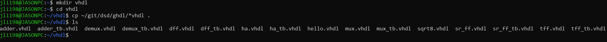

# Lab 1 - GHDL and GTKWave

* Go to the GitHub repository of Digital System Design (DSD)
  * Study VHDL and GHDL
* Go to the GHDL folder
  * Install GHDL and GTKWave
  * Run Half Adder Example
  * Run another example such as D Flip-Flop or 4-to-1 Multiplexer
  * Document results on your GitHub repository

## Installing GHDL and GTKWave

For simplicity sake, [Ubuntu was installed](https://ubuntu.com/tutorials/install-ubuntu-on-wsl2-on-windows-10#1-overview) via [Windows Subsytem for Linux (WSL)](https://en.wikipedia.org/wiki/Windows_Subsystem_for_Linux). It was not that hard of an installation process! </br>
</br>

The GHDL folder can be accessed by typing:

```sh
cd ghdl
```

The command cd changes directory and will take us into the ghdl folder. </br>
</br>

The following commands were inputted and some of the outputs are recorded below.

```sh
$ cat /etc/os-release
PRETTY_NAME="Ubuntu 22.04.1 LTS"
NAME="Ubuntu"
VERSION_ID="22.04"
VERSION="22.04.1 LTS (Jammy Jellyfish)"
VERSION_CODENAME=jammy
ID=ubuntu
ID_LIKE=debian
HOME_URL="https://www.ubuntu.com/"
SUPPORT_URL="https://help.ubuntu.com/"
BUG_REPORT_URL="https://bugs.launchpad.net/ubuntu/"
PRIVACY_POLICY_URL="https://www.ubuntu.com/legal/terms-and-policies/privacy-policy"
UBUNTU_CODENAME=jammy

$ sudo apt update
$ sudo apt install gtkwave
$ sudo apt install git make gnat zlib1g-dev
$ git clone https://github.com/ghdl/ghdl
$ cd ghdl

$ ./configure --prefix=/usr/local
gcc (Ubuntu 11.3.0-1ubuntu1~22.04) 11.3.0
Copyright (C) 2021 Free Software Foundation, Inc.
This is free software; see the source for copying conditions.  There is NO
warranty; not even for MERCHANTABILITY or FITNESS FOR A PARTICULAR PURPOSE.

Use full IEEE library
Build machine is: x86_64-linux-gnu
create pic/ subdirectory
Creating Makefile
Creating default_paths.ads
Creating ghdl.gpr
Creating scripts/gcc/Make-lang.in
for d in ieee/v87 ieee/v93 ieee/v08 std/v87 std/v93 std/v08 src/ieee src/ieee/v87 src/ieee/v93 src/ieee2008 src/std src/std/v87 src/std/v93 src/std/v08 src/synopsys src/synopsys/v08 src/upf src/vital95 src/vital2000; do \
  mkdir -p lib/ghdl/$d; \
done
Generate ortho_code-x86-flags.ads
Generate elf_arch.ads
Generate ghdlsynth_maybe.ads
Generate grt-readline.ads

$ make
$ sudo make install
```

The DSD repo was cloned and the contents inside the vhdl folder were copied into a local folder using these commands.

```sh
$ git clone https://github.com/kevinwlu/dsd.git
$ mkdir vhdl
$ cd vhdl
$ cp ~/dsd/ghdl/*vhdl .
```



## Half Adder

### What is a Half-Adder?

[Half-Adder](https://en.wikipedia.org/wiki/Adder_(electronics)#Half_adder) </br>
An adder is a digital circuit in the arithmetic logic unit (ALU) that adds numbers. The half adder adds two single binary digits **A** and **B**. </br>
</br>

### Running Half-Adder in GTKWave

The following commands were inputted and the resulting digital signal is attached.

```sh
$ ghdl -a ha.vhdl
$ ghdl -a ha_tb.vhdl
$ ghdl -e ha_tb
$ ghdl -r ha_tb --vcd=ha.vcd
ha_tb.vhdl:47:5:@5ns:(assertion error): Reached end of test
$ sudo gtkwave ha.vcd
GTKWave Analyzer v3.3.104 (w)1999-2020 BSI

[0] start time.
[5000000] end time.
```

Note: Because the Ubuntu instance used in this demo is not in a root directory, running gtkwave displays this message but the application still runs:

```sh
(gtkwave:7117): dconf-WARNING **: 17:59:37.128: failed to commit changes to dconf: Could not connect: No such file or directory
```

If affected, put sudo before any gtkwave command. </br>
</br>
When the app opens, one can see the SST tab and the entity ha_tb on the left. Click on this to see the entiyy half_addr. Right click on half_addr and Select either Append, Insert, or Replace inside the Recurse Import option. </br>
</br>
There is also a tab in the lower left with Type and Signals when the parent entity is clicked on. One can select these components (with the control key) and add the entities to the graph that way. </br>
</br>
After importing half_addr, there may not be anything. To see the whole digital signal, hold control and use the scroll wheel to scroll until the signal can be fully seen.


## D Flip-Flop

### What is a D Flip-Flop

[Flip-flop](https://en.wikipedia.org/wiki/Flip-flop_(electronics)) </br>
[D Flip-flop](https://www.analog.com/en/design-center/glossary/d-flip-flop.html#:~:text=A%20D%20(or%20Delay)%20Flip%20Flop,is%20shown%20in%20Figure%202.) </br>
Flip-flops are circuits with 2 states that stores states. D (or Delay) Flip-Flops delay the change of state of its outut signal until the input signal is triggered in its next cycle. It is used for memory espeically when shifting registers.

### Running D Flip-Flop in GTKWave

The following commands were inputted and the resulting digital signal is attached.

```sh
$ ghdl -a dff.vhdl
$ ghdl -a dff_tb.vhdl
$ ghdl -e dff_tb
$ sudo ghdl -r dff_tb --vcd=dff.vcd
$ sudo gtkwave dff.vcd
GTKWave Analyzer v3.3.104 (w)1999-2020 BSI

[0] start time.
[210000000] end time
```

Note: When running `ghdl -r dff_tb --vcd=dff.vcd`, the file may not be able to open: `ghdl:error: cannot open dff.vcd`. Try putting sudo before the command. </br>
Make sure to follow the steps in the Half Adder example to see the full digital signal. The entities will have different names, but the process will be the same.


## 4-to-1 Multiplexer

### Multiplexer

[Multiplexer](https://en.wikipedia.org/wiki/Multiplexer) </br>
[4-to-1 Multiplexer](https://allaboutfpga.com/vhdl-4-to-1-mux-multiplexer) </br>
A multiplexer decides between analog or digital inputs and forwards a selected input to a single output. Several inputs can be in a device especially those like [analog-to-digital converters](https://en.wikipedia.org/wiki/Analog-to-digital_converter). A 4-to-1 mux has 4 inputs and one output.

### Running 4-to-1 Multiplexer in GTKWave

The following commands were inputted and the resulting digital signal is attached.

```sh
$ ghdl -a mux.vhdl
$ ghdl -a mux_tb.vhdl
$ ghdl -e mux_tb
$ ghdl -r mux_tb --vcd=mux.vcd
$ sudo gtkwave mux.vcd
GTKWave Analyzer v3.3.104 (w)1999-2020 BSI

[0] start time.
[500000000] end time.
```

Make sure to follow the steps in the Half Adder example to see the full digital signal. The entities will have different names, but the process will be the same.


## References

[GHDL README.md in DSD GitHub Repo](https://github.com/kevinwlu/dsd/tree/master/ghdl)