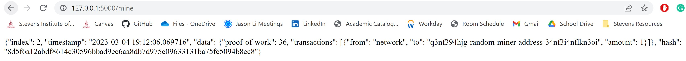
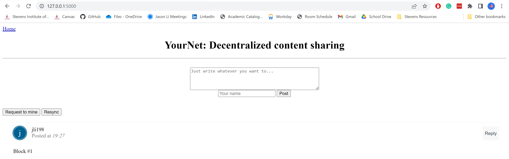
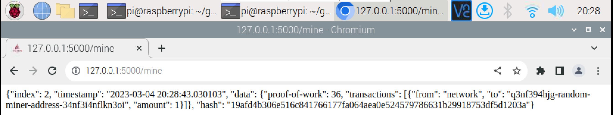
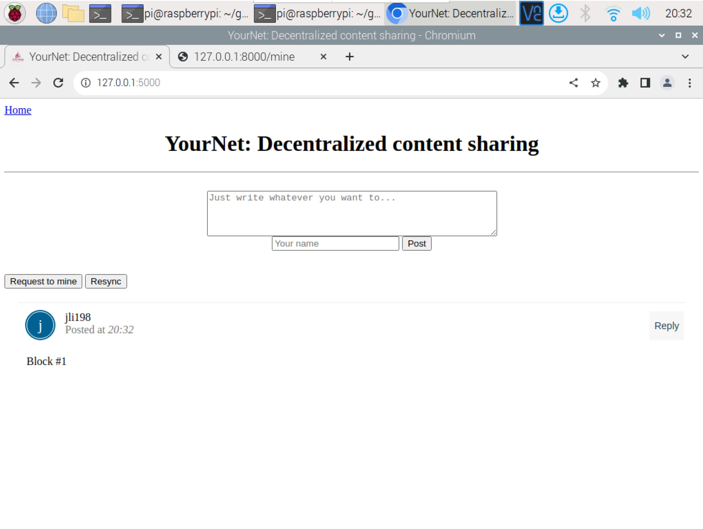

# Lab 10 - Blockchain

* Study GitHub [repository](https://github.com/kevinwlu/iot/tree/master/lesson10) Lesson 10
* Run hash_value.py twice and compare results
* Run snakecoin.py
* Run snakecoin-server-full-code.py on Terminal 1 and mine new block on Terminal 2
* Clone Python blockchain app and uncomment last line of node_server.py
* Run node_server.py on Terminal 1 and run_app.py on Terminal 2

## hash_value.py (Ubuntu)

```sh
$ python3 hash_value.py
The hash for 1 is: 1
The hash for 1.0 is: 1
The hash for 3.14 is: 322818021289917443
The hash for Python is: -1041291023679038627
The hash for a tuple of vowels is: 5813075330827384265
The hash for an object of person is: 6017268066085650822

$ python3 hash_value.py
The hash for 1 is: 1
The hash for 1.0 is: 1
The hash for 3.14 is: 322818021289917443
The hash for Python is: -2319530772965100440
The hash for a tuple of vowels is: 3334971185708091956
The hash for an object of person is: 8875694290405890925
```

## snakecoin.py (Ubuntu)

```sh
$ cat snakecoin.py
# Gerald Nash, "Let's build the tiniest blockchain in less than 50 lines of Python"
import hashlib as hasher
import datetime as date

# Define what a Snakecoin block is
class Block:
  def __init__(self, index, timestamp, data, previous_hash):
    self.index = index
    self.timestamp = timestamp
    self.data = data
    self.previous_hash = previous_hash
    self.hash = self.hash_block()
  
  def hash_block(self):
    sha = hasher.sha256()
    sha.update(str(self.index).encode() + str(self.timestamp).encode() + str(self.data).encode() + str(self.previous_hash).encode())
    return sha.hexdigest()

# Generate genesis block
def create_genesis_block():
  # Manually construct a block with
  # index zero and arbitrary previous hash
  return Block(0, date.datetime.now(), "Genesis Block", "0")

# Generate all later blocks in the blockchain
def next_block(last_block):
  this_index = last_block.index + 1
  this_timestamp = date.datetime.now()
  this_data = "Hey! I'm block " + str(this_index)
  this_hash = last_block.hash
  return Block(this_index, this_timestamp, this_data, this_hash)

# Create the blockchain and add the genesis block
blockchain = [create_genesis_block()]
previous_block = blockchain[0]

# How many blocks should we add to the chain
# after the genesis block
num_of_blocks_to_add = 20

# Add blocks to the chain
for i in range(0, num_of_blocks_to_add):
  block_to_add = next_block(previous_block)
  blockchain.append(block_to_add)
  previous_block = block_to_add
  # Tell everyone about it!
  print("Block #{} has been added to the blockchain!".format(block_to_add.index))
  print("Hash: {}\n".format(block_to_add.hash))

$ python3 snakecoin.py

Block #1 has been added to the blockchain!
Hash: 31d5e8a2606b34d6e23151bc8b739f90dc368ffc00abf951f70c3519a39a89e4

Block #2 has been added to the blockchain!
Hash: 28cfe98374fffa78d81f6162fb5a986f6537904f51418d746e8e52f394e1c6d0

Block #3 has been added to the blockchain!
Hash: a921a94808b4d5e022cc3f07d3d59a20ac41266e70cd707217b45ce8b2df6db3

Block #4 has been added to the blockchain!
Hash: a848fdfa2c23ffc3cba1fc959af00263443f87563ce5b3f746f6f3f276e25178

Block #5 has been added to the blockchain!
Hash: 4ea7ee74379b324fc6466c942b3eb51b9f10996cd448296f54d4ef0bafc8b647

Block #6 has been added to the blockchain!
Hash: 4ce280651df525cc02ba7bece7f7764668f7fbac9cb4fdd8019df257d67fb790

Block #7 has been added to the blockchain!
Hash: c3cef6fa5de67c787f5179f1be42f332097dbcb8a949a813a52eef29c800e1ae

Block #8 has been added to the blockchain!
Hash: 3bc57069754aa71b2f4d80b19227b4f9038dcb40dfc1a17258d2a24a9b38c81e

Block #9 has been added to the blockchain!
Hash: 374647be1cf8224433f771521aceb5f6e45c0c65597e44be161eff5bc65cea5b

Block #10 has been added to the blockchain!
Hash: 1263ec9be454c946c9460868fc2edeb02e916f2fc4ddfd0aa99ae3aa53961227

Block #11 has been added to the blockchain!
Hash: e00d30d9a5eb443f1efc62431b4cf5f5d0cd6fff210ca461e5486667631e5953

Block #12 has been added to the blockchain!
Hash: a28cbaf3354c729fc5d5a158e103015e562f573aabb5d6a8290fc2dac996c93a

Block #13 has been added to the blockchain!
Hash: 56fb7eabd56f2adb7e2fc8cb5f2dea7a15c4d8906172f88427ba24c824508376

Block #14 has been added to the blockchain!
Hash: b44114fc7f54841af2d5ef6eb64547397ba029879dab904077c6970e341e250e

Block #15 has been added to the blockchain!
Hash: 03a2024fb5c5a85306ae0b27a489d1e0de5531cd904eb42aeb9f4783581e13b0

Block #16 has been added to the blockchain!
Hash: a8c60366ab01c08564ec7145a4a115bee28f816c5c3ee10e85c884b5c9b61316

Block #17 has been added to the blockchain!
Hash: 45f6fbc3ce704261d02e0c3dd00f71c9169ed1a4c305feef8a3c06f6558edef6

Block #18 has been added to the blockchain!
Hash: 6af16255d8d919a93db99695b93134f7d69d3500b9886e6f0aa0c9ef9915d8a6

Block #19 has been added to the blockchain!
Hash: c1ae8fed38d13c7d3bf22d2e30205571f01a282455612c68ed37a7c01ea344c2

Block #20 has been added to the blockchain!
Hash: a3693024babdb83271c18d5eccddac03318ef0a104e6e4a9ec21b4d93909d5cf
```

## snakecoin-server-full-code.py (Ubuntu)

Terminal 1: Run SnakeCoin server at http://127.0.0.1:5000/ (Press Ctrl+C to quit)

```sh
$ python3 snakecoin-server-full-code.py
 * Serving Flask app 'snakecoin-server-full-code'
 * Debug mode: off
WARNING: This is a development server. Do not use it in a production deployment. Use a production WSGI server instead.
 * Running on http://127.0.0.1:5000
Press CTRL+C to quit
127.0.0.1 - - [04/Mar/2023 19:10:47] "GET / HTTP/1.1" 200 -
127.0.0.1 - - [04/Mar/2023 19:10:47] "GET /favicon.ico HTTP/1.1" 200 -
New transaction
FROM: b'akjflw'
TO: b'fjlakdj'
AMOUNT: 3

127.0.0.1 - - [04/Mar/2023 19:11:08] "POST /txion HTTP/1.1" 200 -
127.0.0.1 - - [04/Mar/2023 19:11:44] "GET /mine HTTP/1.1" 200 -
127.0.0.1 - - [04/Mar/2023 19:12:06] "GET /mine HTTP/1.1" 200 -
```

Terminal 2: Create transaction and mine new block at http://127.0.0.1:5000/mine

```sh
$ curl "localhost:5000/txion" \
     -H "Content-Type: application/json" \
     -d '{"from": "akjflw", "to":"fjlakdj", "amount": 3}'
Transaction submission successful

$ curl localhost:5000/mine
{"index": 1, "timestamp": "2023-03-04 19:11:44.075770", "data": {"proof-of-work": 18, "transactions": [{"from": "akjflw", "to": "fjlakdj", "amount": 3}, {"from": "network", "to": "q3nf394hjg-random-miner-address-34nf3i4nflkn3oi", "amount": 1}]}, "hash": "ec990801accc38cd3d5b3ff3a66085d58fd55de7fad73ece78874c0dbbed3e9d"}
```



## Run node_server.py and run_app.py (Ubuntu)

Terminal 1: Uncomment last line of node_server.py (or search for port=8000) and run (Press Ctrl+C to quit)

* In [GNU nano](https://en.wikipedia.org/wiki/GNU_nano) text editor, Ctrl + W (shown as ^W) goes to search menu

```sh
$ nano node_server.py
$ python3 node_server.py
 * Serving Flask app 'node_server'
 * Debug mode: on
WARNING: This is a development server. Do not use it in a production deployment. Use a production WSGI server instead.
 * Running on http://127.0.0.1:8000
Press CTRL+C to quit
 * Restarting with stat
 * Debugger is active!
 * Debugger PIN: 394-696-943
127.0.0.1 - - [04/Mar/2023 19:25:48] "GET /chain HTTP/1.1" 200 -
127.0.0.1 - - [04/Mar/2023 19:27:27] "POST /new_transaction HTTP/1.1" 201 -
127.0.0.1 - - [04/Mar/2023 19:27:27] "GET /chain HTTP/1.1" 200 -
127.0.0.1 - - [04/Mar/2023 19:27:41] "GET /chain HTTP/1.1" 200 -
127.0.0.1 - - [04/Mar/2023 19:27:54] "GET /mine HTTP/1.1" 200 -
127.0.0.1 - - [04/Mar/2023 19:27:54] "GET /favicon.ico HTTP/1.1" 404 -
127.0.0.1 - - [04/Mar/2023 19:27:57] "GET /chain HTTP/1.1" 200 -
```

Terminal 2: Run run_app.py (Press Ctrl+C to quit)

```sh
$ python3 run_app.py
 * Serving Flask app 'app'
 * Debug mode: on
WARNING: This is a development server. Do not use it in a production deployment. Use a production WSGI server instead.
 * Running on http://127.0.0.1:5000
Press CTRL+C to quit
 * Restarting with stat
 * Debugger is active!
 * Debugger PIN: 394-696-943
127.0.0.1 - - [04/Mar/2023 19:25:48] "GET / HTTP/1.1" 200 -
127.0.0.1 - - [04/Mar/2023 19:27:27] "POST /submit HTTP/1.1" 302 -
127.0.0.1 - - [04/Mar/2023 19:27:27] "GET / HTTP/1.1" 200 -
127.0.0.1 - - [04/Mar/2023 19:27:41] "GET / HTTP/1.1" 200 -
127.0.0.1 - - [04/Mar/2023 19:27:57] "GET / HTTP/1.1" 200 -
```

* Open browser and go to YourNet running at http://127.0.0.1:5000/
* Enter content and name, click "Post," and click "Request to mine" that generate "Block #1 is mined" at http://127.0.0.1:8000/mine
* At YourNet, click "Resync" to view Block #1



## hash_value.py (Raspberry Pi)

```sh
$ python3 hash_value.py
The hash for 1 is: 1
The hash for 1.0 is: 1
The hash for 3.14 is: 322818021289917443
The hash for Python is: -2489869605110888164
The hash for a tuple of vowels is: 1311283044220466297
The hash for an object of person is: -646355389735414921

$ python3 hash_value.py
The hash for 1 is: 1
The hash for 1.0 is: 1
The hash for 3.14 is: 322818021289917443
The hash for Python is: -4004958737686007034
The hash for a tuple of vowels is: 2927456187822246983
The hash for an object of person is: -2706903475827019646
```

## snakecoin.py (Raspberry Pi)

```sh
$ cat snakecoin.py
# Gerald Nash, "Let's build the tiniest blockchain in less than 50 lines of Python"
import hashlib as hasher
import datetime as date

# Define what a Snakecoin block is
class Block:
  def __init__(self, index, timestamp, data, previous_hash):
    self.index = index
    self.timestamp = timestamp
    self.data = data
    self.previous_hash = previous_hash
    self.hash = self.hash_block()
  
  def hash_block(self):
    sha = hasher.sha256()
    sha.update(str(self.index).encode() + str(self.timestamp).encode() + str(self.data).encode() + str(self.previous_hash).encode())
    return sha.hexdigest()

# Generate genesis block
def create_genesis_block():
  # Manually construct a block with
  # index zero and arbitrary previous hash
  return Block(0, date.datetime.now(), "Genesis Block", "0")

# Generate all later blocks in the blockchain
def next_block(last_block):
  this_index = last_block.index + 1
  this_timestamp = date.datetime.now()
  this_data = "Hey! I'm block " + str(this_index)
  this_hash = last_block.hash
  return Block(this_index, this_timestamp, this_data, this_hash)

# Create the blockchain and add the genesis block
blockchain = [create_genesis_block()]
previous_block = blockchain[0]

# How many blocks should we add to the chain
# after the genesis block
num_of_blocks_to_add = 20

# Add blocks to the chain
for i in range(0, num_of_blocks_to_add):
  block_to_add = next_block(previous_block)
  blockchain.append(block_to_add)
  previous_block = block_to_add
  # Tell everyone about it!
  print("Block #{} has been added to the blockchain!".format(block_to_add.index))
  print("Hash: {}\n".format(block_to_add.hash))

$ python3 snakecoin.py
Block #1 has been added to the blockchain!
Hash: 45b582104db3ff38f9da89abde7ca3236a7aeb71091ae094d539ccc7508744d8

Block #2 has been added to the blockchain!
Hash: 4c94f4bea80c916c83b6f7869e6d6c32b70481388fa9d0e48722e566f6f30634

Block #3 has been added to the blockchain!
Hash: 05c76d25ae4af6ac695371c22eec7123bc53bdf653db97768ba2c3184ab0c0fb

Block #4 has been added to the blockchain!
Hash: d36a9fb747a4f90ac8f0a71aadd231e570a6dee805aa63b78c12bd12b37346eb

Block #5 has been added to the blockchain!
Hash: 2b432292bc1468da6c5e4ea2b23480520efb0a19fd3dec9b497b4c62372942de

Block #6 has been added to the blockchain!
Hash: 4bc0a8dc558bc18c76ba54754efe71ec0532811e22b750972fa566a2f5fa8589

Block #7 has been added to the blockchain!
Hash: bcf3544b7784ac04cb3141bee2d036e07307eed67c33aecbfb3b1812b6e51326

Block #8 has been added to the blockchain!
Hash: 7ed1eaa28ff41b7d73a8751ecac3dd1eab3be7300798f160833514b20c1fe6dc

Block #9 has been added to the blockchain!
Hash: 53c52b006d02b8001dfa511b98acc18ca149cd81b01af1422e9f004d30eaf8a7

Block #10 has been added to the blockchain!
Hash: df77ed55de8bfc1109dbc8903c3e5ef0360eb7c0496ddfac344bb9d7f0ec214e

Block #11 has been added to the blockchain!
Hash: 2d9e8f08746016b3a0e55b3a44a17c5d78b6c1be7d642c36740ba129ada4635b

Block #12 has been added to the blockchain!
Hash: 1f0976e900179264744fabb054332e2d2b0dfd75e52fa5b4bb5e8781d0680efd

Block #13 has been added to the blockchain!
Hash: a027a8ca01ed4e27f796cbd6dcae7f7ca7ef17ae2338d5e207c56665a8198649

Block #14 has been added to the blockchain!
Hash: 6ecd67d7783e4f29c289bc56353cd36e69eb0bc4e44d67364c7508a8a8eaa183

Block #15 has been added to the blockchain!
Hash: 1065c4752b9ca9cde616effbfd89792c233e8c2345760d15f26c21e643d221fe

Block #16 has been added to the blockchain!
Hash: c345b2dafdcd78090b02e81a6a659acb5ec6377acbadaa9353282555d903be5a

Block #17 has been added to the blockchain!
Hash: ae455379d0e8b65994af2b79ab860ad4212ea184560200cef08223ddc8843f6a

Block #18 has been added to the blockchain!
Hash: 915cc463ed02d961e579b1038d0b3481d3c23e14f875e88de69cdde59183bbe0

Block #19 has been added to the blockchain!
Hash: 2602ff07b5693a85dbe8701957b09051c557882120c46735f3b00758281fd278

Block #20 has been added to the blockchain!
Hash: f894cf0e71ff31d00d941d392d32e86e6fa3d74813992de2d46b37aa8ae8ae71
```

## snakecoin-server-full-code.py (Raspberry Pi)

Terminal 1: Run SnakeCoin server at http://127.0.0.1:5000/ (Press Ctrl+C to quit)

```sh
$ python3 snakecoin-server-full-code.py
 * Running on http://127.0.0.1:5000/ (Press CTRL+C to quit)
New transaction
FROM: b'akjflw'
TO: b'fjlakdj'
AMOUNT: 3

127.0.0.1 - - [04/Mar/2023 20:27:15] "POST /txion HTTP/1.1" 200 -
127.0.0.1 - - [04/Mar/2023 20:27:38] "GET /mine HTTP/1.1" 200 -
127.0.0.1 - - [04/Mar/2023 20:28:38] "GET / HTTP/1.1" 200 -
127.0.0.1 - - [04/Mar/2023 20:28:38] "GET /favicon.ico HTTP/1.1" 304 -
127.0.0.1 - - [04/Mar/2023 20:28:43] "GET /mine HTTP/1.1" 200 -
```

Terminal 2: Create transaction and mine new block at http://127.0.0.1:5000/mine

```sh
$ curl "localhost:5000/txion" \
     -H "Content-Type: application/json" \
     -d '{"from": "akjflw", "to":"fjlakdj", "amount": 3}'
Transaction submission successful

$ curl localhost:5000/mine
{"index": 1, "timestamp": "2023-03-04 20:27:38.960331", "data": {"proof-of-work": 18, "transactions": [{"from": "akjflw", "to": "fjlakdj", "amount": 3}, {"from": "network", "to": "q3nf394hjg-random-miner-address-34nf3i4nflkn3oi", "amount": 1}]}, "hash": "d3bcaed98c22fab3a1f1cddce7e6b79de2a9ec5645401e5d81f99d7aa018053e"}
```



## Run node_server.py and run_app.py (Raspberry Pi)

Terminal 1: Uncomment last line of node_server.py (or search for port=8000) and run (Press Ctrl+C to quit)

* In [GNU nano](https://en.wikipedia.org/wiki/GNU_nano) text editor, Ctrl + W (shown as ^W) goes to search menu

```sh
$ nano node_server.py
$ python3 node_server.py
 * Running on http://127.0.0.1:8000/ (Press CTRL+C to quit)
 * Restarting with stat
 * Debugger is active!
 * Debugger PIN: 169-769-336
127.0.0.1 - - [04/Mar/2023 20:32:31] "GET /chain HTTP/1.1" 200 -
127.0.0.1 - - [04/Mar/2023 20:32:41] "POST /new_transaction HTTP/1.1" 201 -
127.0.0.1 - - [04/Mar/2023 20:32:41] "GET /chain HTTP/1.1" 200 -
127.0.0.1 - - [04/Mar/2023 20:32:43] "GET /mine HTTP/1.1" 200 -
127.0.0.1 - - [04/Mar/2023 20:32:43] "GET /favicon.ico HTTP/1.1" 404 -
127.0.0.1 - - [04/Mar/2023 20:32:46] "GET /chain HTTP/1.1" 200 -
```

Terminal 2: Run run_app.py (Press Ctrl+C to quit)

```sh
$ python3 run_app.py
 * Running on http://127.0.0.1:5000/ (Press CTRL+C to quit)
 * Restarting with stat
 * Debugger is active!
 * Debugger PIN: 169-769-336
127.0.0.1 - - [04/Mar/2023 20:32:31] "GET / HTTP/1.1" 200 -
127.0.0.1 - - [04/Mar/2023 20:32:41] "POST /submit HTTP/1.1" 302 -
127.0.0.1 - - [04/Mar/2023 20:32:41] "GET / HTTP/1.1" 200 -
127.0.0.1 - - [04/Mar/2023 20:32:46] "GET / HTTP/1.1" 200 -
```

* Open browser and go to YourNet running at http://127.0.0.1:5000/
* Enter content and name, click "Post," and click "Request to mine" that generate "Block #1 is mined" at http://127.0.0.1:8000/mine
  * This opened up the mine page of the website automatically in another Chromium tab!
* At YourNet, click "Resync" to view Block #1


