# Lab 2 - Command Line

* Go to IoT [repository](https://github.com/kevinwlu/iot)
* Study Lessons 1 and 2
* Open terminal

```sh
$ hostname
$ env
(this'll be long)
$ ps
$ pwd
$ git clone https://github.com/kevinwlu/iot.git
$ cd iot
$ ls
$ cd
$ df
$ mkdir demo
$ cd demo
$ nano file
$ cat file
$ cp file file1
$ mv file file2
$ rm file2
$ clear
$ man uname
$ uname -a
$ ifconfig
$ ping localhost
$ netstat
```

## What Do these Command Mean?

[Command Explainer](https://explainshell.com/)

### hostname

```hostname``` is the name of the device (in this case Raspberry Pi).

### env

```env``` prints out enviornment variables. It's a lot due to my tinkering on my Raspberry Pi!

### ps

```ps``` showcases the processes run on my Raspberry Pi.

### pwd

```pwd``` prints the working directory of my Pi.

### git clone, cd iot, ls, cd

Here are all the commands for the IoT GitHub repo: </br>
```git clone``` clones a git repo. This will work all the time when you connect your git repo to your account but for SSH, you need to do more steps. </br>
```cd iot``` will take the user into the iot folder we just downloaded from GitHub. </br>
```ls``` lists the directories in the folder. In this case, it lists what is inside the iot folder. </br>
```cd``` will take one back up a directory. In this case, it takes the user back to the home directory.

### df

```df``` displays file system information. This is useful when checking how much space is left on your disk. </br>
```df -h``` with ```-h``` flag makes it human readable, i.e., makes bytes into MBs, GBs, etc.

### mkdir, cd demo, cat file, cp, mv, rm

```mkdir demo``` will make a directory called demo. </br>
```cd demo``` will take one into the newly minted demo directory. </br>
```cat file``` concetenates files or standard input to standard input. tl;dr will display contents of a file.</br>
```cp``` will copy a file into another file. ```cp file file1``` will copy the contents of file into file1. </br>
```mv``` moves the file. This is how you rename the file by changing the name and you can move via directory paths. </br>
```rm``` will remove and delete a file.

### nano file

```nano file``` initiates a file in text editor nano. Compared to Vi(m), nano is better imo. </br>
One can click and enter text easily compared to navigating Vi(m) via keyboard controls. </br>
To save and exit the file, ```ctrl + x```, ```Y```, then press ```Enter```.

### clear

```clear```: clears the screen. It removes the text currently on the CLI. </br>

### man uname

```man``` stands for manual. It will show the manual (RTM) for the command uname. </br>

### uname -a

```uname -a``` prints system information. ```-a``` flag will print all the system information.

### ifconfig

```ifconfig``` showcases all the network config interfaces on one's device. One can find ethernet addresses, IP addresses, netmask, broadcast, etc.

### ping localhost

```ping localhost``` sends ICMP ECHO_REQUEST packets to network host(s) (in this case localhost).

### netstat

```netstat``` prints network connections, routing tables, interface statistics, masquerade connections, and multicast memberships. </br>
It is a long list as it looks like it shows Unix processes. DO NOT USE to find IP address/other network info.

## CLI on Raspberry Pi

```sh
$ hostname
raspberrypi

$ env
SHELL=/bin/bash
COLORTERM=truecolor
XDG_CONFIG_DIRS=/etc/xdg
XDG_SESSION_PATH=/org/freedesktop/DisplayManager/Session0
XDG_MENU_PREFIX=lxde-pi-
LANGUAGE=en_US.UTF-8
_LXSESSION_PID=2646
SSH_AUTH_SOCK=/tmp/ssh-COt4Wut4myPE/agent.2646
XDG_CONFIG_HOME=/home/pi/.config
DESKTOP_SESSION=LXDE-pi
SSH_AGENT_PID=2694
NO_AT_BRIDGE=1
XDG_SEAT=seat0
PWD=/home/pi
LOGNAME=pi
XDG_SESSION_DESKTOP=lightdm-xsession
QT_QPA_PLATFORMTHEME=qt5ct
XDG_SESSION_TYPE=x11
GPG_AGENT_INFO=/run/user/1000/gnupg/S.gpg-agent:0:1
XAUTHORITY=/home/pi/.Xauthority
XDG_GREETER_DATA_DIR=/var/lib/lightdm/data/pi
HOME=/home/pi
LANG=en_US.UTF-8
LS_COLORS=rs=0:di=01;34:ln=01;36:mh=00:pi=40;33:so=01;35:do=01;35:bd=40;33;01:cd=40;33;01:or=40;31;01:mi=00:su=37;41:sg=30;43:ca=30;41:tw=30;42:ow=34;42:st=37;44:ex=01;32:*.tar=01;31:*.tgz=01;31:*.arc=01;31:*.arj=01;31:*.taz=01;31:*.lha=01;31:*.lz4=01;31:*.lzh=01;31:*.lzma=01;31:*.tlz=01;31:*.txz=01;31:*.tzo=01;31:*.t7z=01;31:*.zip=01;31:*.z=01;31:*.dz=01;31:*.gz=01;31:*.lrz=01;31:*.lz=01;31:*.lzo=01;31:*.xz=01;31:*.zst=01;31:*.tzst=01;31:*.bz2=01;31:*.bz=01;31:*.tbz=01;31:*.tbz2=01;31:*.tz=01;31:*.deb=01;31:*.rpm=01;31:*.jar=01;31:*.war=01;31:*.ear=01;31:*.sar=01;31:*.rar=01;31:*.alz=01;31:*.ace=01;31:*.zoo=01;31:*.cpio=01;31:*.7z=01;31:*.rz=01;31:*.cab=01;31:*.wim=01;31:*.swm=01;31:*.dwm=01;31:*.esd=01;31:*.jpg=01;35:*.jpeg=01;35:*.mjpg=01;35:*.mjpeg=01;35:*.gif=01;35:*.bmp=01;35:*.pbm=01;35:*.pgm=01;35:*.ppm=01;35:*.tga=01;35:*.xbm=01;35:*.xpm=01;35:*.tif=01;35:*.tiff=01;35:*.png=01;35:*.svg=01;35:*.svgz=01;35:*.mng=01;35:*.pcx=01;35:*.mov=01;35:*.mpg=01;35:*.mpeg=01;35:*.m2v=01;35:*.mkv=01;35:*.webm=01;35:*.webp=01;35:*.ogm=01;35:*.mp4=01;35:*.m4v=01;35:*.mp4v=01;35:*.vob=01;35:*.qt=01;35:*.nuv=01;35:*.wmv=01;35:*.asf=01;35:*.rm=01;35:*.rmvb=01;35:*.flc=01;35:*.avi=01;35:*.fli=01;35:*.flv=01;35:*.gl=01;35:*.dl=01;35:*.xcf=01;35:*.xwd=01;35:*.yuv=01;35:*.cgm=01;35:*.emf=01;35:*.ogv=01;35:*.ogx=01;35:*.aac=00;36:*.au=00;36:*.flac=00;36:*.m4a=00;36:*.mid=00;36:*.midi=00;36:*.mka=00;36:*.mp3=00;36:*.mpc=00;36:*.ogg=00;36:*.ra=00;36:*.wav=00;36:*.oga=00;36:*.opus=00;36:*.spx=00;36:*.xspf=00;36:
XDG_CURRENT_DESKTOP=LXDE
VTE_VERSION=6203
XDG_SEAT_PATH=/org/freedesktop/DisplayManager/Seat0
XDG_SESSION_CLASS=user
TERM=xterm-256color
USER=pi
DISPLAY=:0
SHLVL=1
XDG_VTNR=7
XDG_SESSION_ID=11
XDG_RUNTIME_DIR=/run/user/1000
LC_ALL=en_US.UTF-8
XDG_DATA_DIRS=/usr/share/fkms:/usr/local/share:/usr/share/raspi-ui-overrides:/usr/share:/usr/share/gdm:/var/lib/menu-xdg
PATH=/home/pi/.local/bin:/usr/local/sbin:/usr/local/bin:/usr/sbin:/usr/bin:/sbin:/bin:/usr/local/games:/usr/games
GDMSESSION=lightdm-xsession
SAL_USE_VCLPLUGIN=gtk3
DBUS_SESSION_BUS_ADDRESS=unix:path=/run/user/1000/bus
TEXTDOMAIN=Linux-PAM
_=/usr/bin/env
OLDPWD=/home/pi/git/d6/cpe322

$ ps

    PID TTY          TIME CMD
   3402 pts/0    00:00:00 bash
   3550 pts/0    00:00:00 ps

$ pwd

/home/pi

$ git clone https://github.com/kevinwlu/iot.git

Cloning into 'iot'...
remote: Enumerating objects: 17461, done.
remote: Counting objects: 100% (175/175), done.
remote: Compressing objects: 100% (62/62), done.
remote: Total 17461 (delta 81), reused 175 (delta 81), pack-reused 17286
Receiving objects: 100% (17461/17461), 27.36 MiB | 6.33 MiB/s, done.
Resolving deltas: 100% (11812/11812), done.

$ cd iot

$ ls

apps   economics  lesson1   lesson2  lesson4  lesson6  lesson8  projects   special_problems  tools
cases  hype       lesson10  lesson3  lesson5  lesson7  lesson9  README.md  standards

$ cd
$ df

Filesystem     1K-blocks     Used Available Use% Mounted on
/dev/root       29725160 13069416  15394164  46% /
devtmpfs          338900        0    338900   0% /dev
tmpfs             471860        0    471860   0% /dev/shm
tmpfs             188748      836    187912   1% /run
tmpfs               5120        4      5116   1% /run/lock
/dev/mmcblk0p1    258095    31071    227025  13% /boot
tmpfs              94372       20     94352   1% /run/user/1000

$ mkdir demo
$ cd demo
$ nano file
$ cat file

Professor Lu is the best professor!

$ cp file file1
$ mv file file2
$ rm file2
$ clear
$ man uname

UNAME(1)                                               User Commands                                              UNAME(1)

NAME
       uname - print system information

SYNOPSIS
       uname [OPTION]...

DESCRIPTION
       Print certain system information.  With no OPTION, same as -s.

       -a, --all
              print all information, in the following order, except omit -p and -i if unknown:

       -s, --kernel-name
              print the kernel name

       -n, --nodename
              print the network node hostname

       -r, --kernel-release
              print the kernel release

       -v, --kernel-version
              print the kernel version

       -m, --machine
              print the machine hardware name

       -p, --processor
              print the processor type (non-portable)

       -i, --hardware-platform
              print the hardware platform (non-portable)

       -o, --operating-system
              print the operating system

       --help display this help and exit

 Manual page uname(1) line 1/63 59% (press h for help or q to quit)

$ uname -a

Linux raspberrypi 5.15.84-v8+ #1613 SMP PREEMPT Thu Jan 5 12:03:08 GMT 2023 aarch64 GNU/Linux

$ ifconfig

docker0: flags=4099<UP,BROADCAST,MULTICAST>  mtu 1500
        inet 172.17.0.1  netmask 255.255.0.0  broadcast 172.17.255.255
        ether 02:42:b9:6e:ca:fe  txqueuelen 0  (Ethernet)
        RX packets 0  bytes 0 (0.0 B)
        RX errors 0  dropped 0  overruns 0  frame 0
        TX packets 0  bytes 0 (0.0 B)
        TX errors 0  dropped 0 overruns 0  carrier 0  collisions 0

eth0: flags=4099<UP,BROADCAST,MULTICAST>  mtu 1500
        ether b8:27:eb:ab:15:4f  txqueuelen 1000  (Ethernet)
        RX packets 0  bytes 0 (0.0 B)
        RX errors 0  dropped 0  overruns 0  frame 0
        TX packets 0  bytes 0 (0.0 B)
        TX errors 0  dropped 0 overruns 0  carrier 0  collisions 0

lo: flags=73<UP,LOOPBACK,RUNNING>  mtu 65536
        inet 127.0.0.1  netmask 255.0.0.0
        inet6 ::1  prefixlen 128  scopeid 0x10<host>
        loop  txqueuelen 1000  (Local Loopback)
        RX packets 32  bytes 3119 (3.0 KiB)
        RX errors 0  dropped 0  overruns 0  frame 0
        TX packets 32  bytes 3119 (3.0 KiB)
        TX errors 0  dropped 0 overruns 0  carrier 0  collisions 0

wlan0: flags=4163<UP,BROADCAST,RUNNING,MULTICAST>  mtu 1500
        inet 192.168.0.26  netmask 255.255.255.0  broadcast 192.168.0.255
        inet6 fe80::3b8:18b2:133:bf6e  prefixlen 64  scopeid 0x20<link>
        ether b8:27:eb:fe:40:1a  txqueuelen 1000  (Ethernet)
        RX packets 51067  bytes 36229801 (34.5 MiB)
        RX errors 0  dropped 0  overruns 0  frame 0
        TX packets 19216  bytes 6099859 (5.8 MiB)
        TX errors 0  dropped 0 overruns 0  carrier 0  collisions 0

$ ping localhost

PING localhost(localhost (::1)) 56 data bytes
64 bytes from localhost (::1): icmp_seq=1 ttl=64 time=0.124 ms
64 bytes from localhost (::1): icmp_seq=2 ttl=64 time=0.125 ms
64 bytes from localhost (::1): icmp_seq=3 ttl=64 time=0.127 ms
64 bytes from localhost (::1): icmp_seq=4 ttl=64 time=0.200 ms
64 bytes from localhost (::1): icmp_seq=5 ttl=64 time=0.115 ms
^C
--- localhost ping statistics ---
5 packets transmitted, 5 received, 0% packet loss, time 4095ms
rtt min/avg/max/mdev = 0.115/0.138/0.200/0.031 ms

$ netstat

Active Internet connections (w/o servers)
Proto Recv-Q Send-Q Local Address           Foreign Address         State      
tcp        0      0 localhost:35336         localhost:34647         ESTABLISHED
tcp        0      0 localhost:34647         localhost:35336         ESTABLISHED
tcp        0      0 192.168.0.26:5900       192.168.0.16:59422      ESTABLISHED
Active UNIX domain sockets (w/o servers)
Proto RefCnt Flags       Type       State         I-Node   Path
unix  4      [ ]         DGRAM      CONNECTED     14672    /var/run/wpa_supplicant/wlan0
unix  2      [ ]         DGRAM                    14696    /var/run/wpa_supplicant/p2p-dev-wlan0
unix  2      [ ]         DGRAM                    24396    /run/user/1000/systemd/notify
unix  4      [ ]         DGRAM      CONNECTED     11491    /run/systemd/notify
unix  2      [ ]         DGRAM                    9708     /run/systemd/journal/syslog
unix  19     [ ]         DGRAM      CONNECTED     9715     /run/systemd/journal/dev-log
unix  8      [ ]         DGRAM      CONNECTED     9717     /run/systemd/journal/socket
unix  2      [ ]         DGRAM                    16416    @/var/spool/exim4/exim_daemon_notify
unix  2      [ ]         DGRAM                    15240    @0000b
unix  2      [ ]         DGRAM      CONNECTED     27803    /tmp/dhcpcd-pi/libdhcpcd-wpa-2754.0
unix  2      [ ]         DGRAM      CONNECTED     27804    /tmp/dhcpcd-pi/libdhcpcd-wpa-2754.1
unix  2      [ ]         DGRAM      CONNECTED     12776    /tmp/.vncserver-license/0.575
unix  3      [ ]         STREAM     CONNECTED     28704    /run/user/1000/menu-cached-:0
unix  3      [ ]         STREAM     CONNECTED     23456    @/tmp/.X11-unix/X0
unix  3      [ ]         STREAM     CONNECTED     25510    /run/user/1000/bus
unix  3      [ ]         STREAM     CONNECTED     23448    
unix  2      [ ]         DGRAM      CONNECTED     12290    
unix  2      [ ]         DGRAM      CONNECTED     12622    
unix  3      [ ]         DGRAM      CONNECTED     10233    
unix  3      [ ]         STREAM     CONNECTED     27786    /run/user/1000/bus
unix  3      [ ]         STREAM     CONNECTED     23526    @/tmp/.X11-unix/X0
unix  3      [ ]         STREAM     CONNECTED     17655    /run/dbus/system_bus_socket
unix  3      [ ]         STREAM     CONNECTED     13813    
unix  2      [ ]         DGRAM      CONNECTED     10784    
unix  2      [ ]         DGRAM      CONNECTED     10714    
unix  3      [ ]         STREAM     CONNECTED     26086    @/tmp/.X11-unix/X0
unix  3      [ ]         STREAM     CONNECTED     14787    
unix  3      [ ]         STREAM     CONNECTED     12440    /run/systemd/journal/stdout
unix  3      [ ]         STREAM     CONNECTED     25708    
unix  3      [ ]         STREAM     CONNECTED     10822    /run/systemd/journal/stdout
unix  3      [ ]         STREAM     CONNECTED     11029    /run/dbus/system_bus_socket
unix  3      [ ]         STREAM     CONNECTED     23359    
unix  3      [ ]         STREAM     CONNECTED     25558    
unix  3      [ ]         STREAM     CONNECTED     25495    
unix  3      [ ]         STREAM     CONNECTED     23530    
unix  3      [ ]         STREAM     CONNECTED     23461    @/tmp/.X11-unix/X0
unix  3      [ ]         STREAM     CONNECTED     26133    /run/systemd/journal/stdout
unix  3      [ ]         STREAM     CONNECTED     27783    @/dbus-vfs-daemon/socket-t4pw6lVR
unix  2      [ ]         DGRAM      CONNECTED     10227    
unix  3      [ ]         STREAM     CONNECTED     10905    
unix  3      [ ]         STREAM     CONNECTED     11006    /run/dbus/system_bus_socket
unix  3      [ ]         STREAM     CONNECTED     24495    
unix  3      [ ]         STREAM     CONNECTED     24446    
unix  3      [ ]         STREAM     CONNECTED     23450    
unix  3      [ ]         STREAM     CONNECTED     11059    
unix  3      [ ]         STREAM     CONNECTED     23457    @/tmp/.X11-unix/X0
unix  2      [ ]         DGRAM      CONNECTED     9811     
unix  3      [ ]         STREAM     CONNECTED     12595    
unix  3      [ ]         STREAM     CONNECTED     28673    /run/user/1000/pulse/native
unix  3      [ ]         STREAM     CONNECTED     23454    @/tmp/.X11-unix/X0
unix  3      [ ]         STREAM     CONNECTED     25529    
unix  3      [ ]         STREAM     CONNECTED     15569    
unix  3      [ ]         DGRAM      CONNECTED     12294    
unix  3      [ ]         STREAM     CONNECTED     26592    
unix  3      [ ]         STREAM     CONNECTED     26090    
unix  3      [ ]         STREAM     CONNECTED     24349    
unix  3      [ ]         DGRAM      CONNECTED     11493    
unix  3      [ ]         STREAM     CONNECTED     26658    /run/user/1000/bus
unix  3      [ ]         STREAM     CONNECTED     15260    /run/containerd/containerd.sock
unix  3      [ ]         STREAM     CONNECTED     12748    /run/systemd/journal/stdout
unix  3      [ ]         STREAM     CONNECTED     14027    /run/dbus/system_bus_socket
unix  3      [ ]         STREAM     CONNECTED     26044    
unix  3      [ ]         STREAM     CONNECTED     17600    /run/systemd/journal/stdout
unix  3      [ ]         STREAM     CONNECTED     13034    
unix  3      [ ]         STREAM     CONNECTED     28714    /run/dbus/system_bus_socket
unix  3      [ ]         STREAM     CONNECTED     23445    
unix  3      [ ]         STREAM     CONNECTED     12396    
unix  3      [ ]         STREAM     CONNECTED     26671    
unix  3      [ ]         STREAM     CONNECTED     23325    /run/dbus/system_bus_socket
unix  3      [ ]         STREAM     CONNECTED     27797    
unix  3      [ ]         STREAM     CONNECTED     11260    
unix  2      [ ]         DGRAM      CONNECTED     14382    
unix  3      [ ]         STREAM     CONNECTED     18458    
unix  3      [ ]         STREAM     CONNECTED     24505    
unix  3      [ ]         STREAM     CONNECTED     10864    
unix  3      [ ]         STREAM     CONNECTED     15001    /run/systemd/journal/stdout
unix  3      [ ]         STREAM     CONNECTED     26063    
unix  3      [ ]         STREAM     CONNECTED     13113    
unix  2      [ ]         DGRAM      CONNECTED     13829    
unix  3      [ ]         STREAM     CONNECTED     23524    
unix  3      [ ]         STREAM     CONNECTED     26038    
unix  3      [ ]         STREAM     CONNECTED     26080    
unix  3      [ ]         STREAM     CONNECTED     14025    
unix  3      [ ]         STREAM     CONNECTED     14021    
unix  3      [ ]         STREAM     CONNECTED     25473    
unix  3      [ ]         STREAM     CONNECTED     10885    /run/systemd/journal/stdout
unix  3      [ ]         DGRAM      CONNECTED     12293    
unix  3      [ ]         STREAM     CONNECTED     23522    
unix  2      [ ]         DGRAM      CONNECTED     24358    
unix  3      [ ]         STREAM     CONNECTED     14379    
unix  3      [ ]         DGRAM      CONNECTED     10232    
unix  3      [ ]         STREAM     CONNECTED     24445    
unix  3      [ ]         STREAM     CONNECTED     11054    
unix  3      [ ]         STREAM     CONNECTED     25501    
unix  3      [ ]         STREAM     CONNECTED     12379    
unix  3      [ ]         STREAM     CONNECTED     12667    /run/systemd/journal/stdout
unix  3      [ ]         STREAM     CONNECTED     13806    
unix  3      [ ]         STREAM     CONNECTED     23446    @/tmp/.X11-unix/X0
unix  2      [ ]         DGRAM                    10949    
unix  3      [ ]         STREAM     CONNECTED     25961    /run/systemd/journal/stdout
unix  3      [ ]         STREAM     CONNECTED     23532    /run/user/1000/bus
unix  3      [ ]         STREAM     CONNECTED     13035    
unix  3      [ ]         STREAM     CONNECTED     25556    /run/user/1000/bus
unix  3      [ ]         STREAM     CONNECTED     23462    
unix  3      [ ]         DGRAM      CONNECTED     15690    
unix  3      [ ]         STREAM     CONNECTED     26111    
unix  3      [ ]         STREAM     CONNECTED     14029    /run/dbus/system_bus_socket
unix  3      [ ]         STREAM     CONNECTED     14403    
unix  3      [ ]         STREAM     CONNECTED     12398    
unix  3      [ ]         STREAM     CONNECTED     26672    /run/user/1000/bus
unix  3      [ ]         STREAM     CONNECTED     15259    
unix  3      [ ]         STREAM     CONNECTED     26085    /run/systemd/journal/stdout
unix  3      [ ]         STREAM     CONNECTED     12438    /run/systemd/journal/stdout
unix  3      [ ]         STREAM     CONNECTED     12771    
unix  3      [ ]         STREAM     CONNECTED     10876    /run/systemd/journal/stdout
unix  3      [ ]         STREAM     CONNECTED     26750    
unix  3      [ ]         STREAM     CONNECTED     27732    
unix  3      [ ]         STREAM     CONNECTED     25567    
unix  3      [ ]         STREAM     CONNECTED     10796    /run/dbus/system_bus_socket
unix  2      [ ]         DGRAM      CONNECTED     9136     
unix  3      [ ]         STREAM     CONNECTED     26045    /run/systemd/journal/stdout
unix  3      [ ]         STREAM     CONNECTED     14463    
unix  3      [ ]         STREAM     CONNECTED     15154    @/tmp/.X11-unix/X0
unix  3      [ ]         STREAM     CONNECTED     23485    
unix  3      [ ]         STREAM     CONNECTED     17657    /run/dbus/system_bus_socket
unix  3      [ ]         STREAM     CONNECTED     27731    
unix  2      [ ]         DGRAM                    25512    
unix  3      [ ]         STREAM     CONNECTED     15124    /run/dbus/system_bus_socket
unix  3      [ ]         STREAM     CONNECTED     27798    /run/dhcpcd.unpriv.sock
unix  3      [ ]         STREAM     CONNECTED     25793    
unix  3      [ ]         STREAM     CONNECTED     23548    
unix  3      [ ]         STREAM     CONNECTED     24437    
unix  3      [ ]         STREAM     CONNECTED     23344    /run/user/1000/pipewire-0
unix  3      [ ]         STREAM     CONNECTED     27821    
unix  3      [ ]         STREAM     CONNECTED     14378    /run/systemd/journal/stdout
unix  3      [ ]         STREAM     CONNECTED     25508    
unix  2      [ ]         STREAM     CONNECTED     27775    
unix  3      [ ]         STREAM     CONNECTED     14404    
unix  3      [ ]         DGRAM      CONNECTED     24398    
unix  2      [ ]         DGRAM      CONNECTED     25557    
unix  3      [ ]         STREAM     CONNECTED     10703    
unix  3      [ ]         STREAM     CONNECTED     23465    @/tmp/.X11-unix/X0
unix  3      [ ]         STREAM     CONNECTED     14697    
unix  3      [ ]         STREAM     CONNECTED     25599    /run/user/1000/bus
unix  3      [ ]         STREAM     CONNECTED     26029    
unix  3      [ ]         STREAM     CONNECTED     14651    
unix  3      [ ]         STREAM     CONNECTED     27782    
unix  3      [ ]         STREAM     CONNECTED     12834    /run/dbus/system_bus_socket
unix  3      [ ]         STREAM     CONNECTED     25559    
unix  3      [ ]         STREAM     CONNECTED     13720    /run/systemd/journal/stdout
unix  3      [ ]         STREAM     CONNECTED     9209     
unix  3      [ ]         STREAM     CONNECTED     23523    /run/systemd/journal/stdout
unix  3      [ ]         STREAM     CONNECTED     26104    
unix  3      [ ]         STREAM     CONNECTED     23525    /run/systemd/journal/stdout
unix  3      [ ]         STREAM     CONNECTED     13811    
unix  3      [ ]         DGRAM      CONNECTED     10231    
unix  3      [ ]         STREAM     CONNECTED     10884    
unix  3      [ ]         STREAM     CONNECTED     16448    /run/containerd/containerd.sock
unix  3      [ ]         STREAM     CONNECTED     23338    /run/dbus/system_bus_socket
unix  3      [ ]         STREAM     CONNECTED     27799    
unix  3      [ ]         STREAM     CONNECTED     26657    /run/user/1000/bus
unix  3      [ ]         STREAM     CONNECTED     17599    
unix  2      [ ]         DGRAM      CONNECTED     14402    
unix  3      [ ]         STREAM     CONNECTED     14381    /run/systemd/journal/stdout
unix  3      [ ]         STREAM     CONNECTED     26683    
unix  3      [ ]         STREAM     CONNECTED     19527    
unix  3      [ ]         STREAM     CONNECTED     23531    
unix  3      [ ]         STREAM     CONNECTED     14649    
unix  3      [ ]         STREAM     CONNECTED     23463    @/tmp/.X11-unix/X0
unix  3      [ ]         STREAM     CONNECTED     26112    
unix  3      [ ]         STREAM     CONNECTED     27764    /run/user/1000/bus
unix  3      [ ]         STREAM     CONNECTED     13765    
unix  2      [ ]         DGRAM      CONNECTED     16431    
unix  3      [ ]         STREAM     CONNECTED     27774    
unix  3      [ ]         STREAM     CONNECTED     24492    
unix  3      [ ]         STREAM     CONNECTED     26073    
unix  3      [ ]         STREAM     CONNECTED     26048    
unix  3      [ ]         STREAM     CONNECTED     14028    /run/dbus/system_bus_socket
unix  2      [ ]         STREAM     CONNECTED     16676    
unix  3      [ ]         STREAM     CONNECTED     12640    /run/dbus/system_bus_socket
unix  3      [ ]         DGRAM      CONNECTED     15691    
unix  3      [ ]         STREAM     CONNECTED     23549    /run/user/1000/bus
unix  3      [ ]         STREAM     CONNECTED     26684    
unix  3      [ ]         STREAM     CONNECTED     25568    /run/user/1000/bus
unix  3      [ ]         STREAM     CONNECTED     25509    
unix  3      [ ]         STREAM     CONNECTED     28140    
unix  3      [ ]         STREAM     CONNECTED     15630    
unix  3      [ ]         STREAM     CONNECTED     11112    /run/systemd/journal/stdout
unix  3      [ ]         STREAM     CONNECTED     26084    
unix  3      [ ]         STREAM     CONNECTED     10828    /run/systemd/journal/stdout
unix  3      [ ]         STREAM     CONNECTED     23343    /run/user/1000/pipewire-0
unix  3      [ ]         STREAM     CONNECTED     15257    
unix  2      [ ]         DGRAM      CONNECTED     12679    
unix  3      [ ]         STREAM     CONNECTED     11028    
unix  3      [ ]         STREAM     CONNECTED     14026    /run/dbus/system_bus_socket
unix  3      [ ]         STREAM     CONNECTED     23331    /run/dbus/system_bus_socket
unix  3      [ ]         STREAM     CONNECTED     26046    /run/dbus/system_bus_socket
unix  3      [ ]         STREAM     CONNECTED     25511    /run/user/1000/bus
unix  3      [ ]         STREAM     CONNECTED     15631    @/tmp/.X11-unix/X0
unix  3      [ ]         STREAM     CONNECTED     28674    /run/user/1000/pulse/native
unix  3      [ ]         STREAM     CONNECTED     26654    
unix  3      [ ]         STREAM     CONNECTED     25807    /run/systemd/journal/stdout
unix  3      [ ]         STREAM     CONNECTED     26593    /run/user/1000/bus
unix  3      [ ]         STREAM     CONNECTED     27785    /run/dbus/system_bus_socket
unix  3      [ ]         STREAM     CONNECTED     16656    
unix  3      [ ]         STREAM     CONNECTED     17651    /run/systemd/journal/stdout
unix  3      [ ]         DGRAM      CONNECTED     24397    
unix  3      [ ]         STREAM     CONNECTED     25766    /run/systemd/journal/stdout
unix  3      [ ]         STREAM     CONNECTED     15189    /run/systemd/journal/stdout
unix  3      [ ]         STREAM     CONNECTED     26105    
unix  3      [ ]         STREAM     CONNECTED     16692    
unix  3      [ ]         STREAM     CONNECTED     11058    
unix  3      [ ]         STREAM     CONNECTED     25500    
unix  3      [ ]         STREAM     CONNECTED     10865    /run/systemd/journal/stdout
unix  3      [ ]         STREAM     CONNECTED     25802    /run/systemd/journal/stdout
unix  3      [ ]         STREAM     CONNECTED     26079    
unix  2      [ ]         STREAM     CONNECTED     14206    
unix  3      [ ]         STREAM     CONNECTED     12433    /run/systemd/journal/stdout
unix  3      [ ]         STREAM     CONNECTED     26766    
unix  3      [ ]         STREAM     CONNECTED     25560    /run/user/1000/bus
unix  2      [ ]         DGRAM      CONNECTED     10904    
unix  3      [ ]         STREAM     CONNECTED     10479    /run/systemd/journal/stdout
unix  3      [ ]         STREAM     CONNECTED     25513    /run/user/1000/bus
unix  3      [ ]         STREAM     CONNECTED     23460    
unix  3      [ ]         STREAM     CONNECTED     25980    /run/dbus/system_bus_socket
unix  3      [ ]         STREAM     CONNECTED     26132    
unix  2      [ ]         STREAM     CONNECTED     16690    
unix  3      [ ]         STREAM     CONNECTED     23521    /run/systemd/journal/stdout
unix  2      [ ]         DGRAM      CONNECTED     14442    
unix  3      [ ]         DGRAM      CONNECTED     10234    
unix  3      [ ]         STREAM     CONNECTED     10795    
unix  3      [ ]         STREAM     CONNECTED     14321    
unix  3      [ ]         STREAM     CONNECTED     25798    /run/systemd/journal/stdout
unix  3      [ ]         STREAM     CONNECTED     12778    /run/systemd/journal/stdout
unix  3      [ ]         STREAM     CONNECTED     26081    
unix  3      [ ]         STREAM     CONNECTED     14095    
unix  3      [ ]         STREAM     CONNECTED     14030    /run/dbus/system_bus_socket
unix  2      [ ]         DGRAM      CONNECTED     25982    
unix  3      [ ]         STREAM     CONNECTED     25519    /run/user/1000/bus
unix  3      [ ]         STREAM     CONNECTED     19528    
unix  3      [ ]         STREAM     CONNECTED     27771    /run/user/1000/bus
unix  3      [ ]         STREAM     CONNECTED     24493    @/tmp/.X11-unix/X0
unix  2      [ ]         DGRAM      CONNECTED     12774    
unix  3      [ ]         STREAM     CONNECTED     14687    /run/dbus/system_bus_socket
unix  3      [ ]         STREAM     CONNECTED     26049    
unix  3      [ ]         STREAM     CONNECTED     14409    
unix  3      [ ]         STREAM     CONNECTED     11086    
unix  3      [ ]         STREAM     CONNECTED     24401    
unix  2      [ ]         DGRAM      CONNECTED     24367    
unix  2      [ ]         DGRAM      CONNECTED     15543    
unix  3      [ ]         STREAM     CONNECTED     24506    @/tmp/.X11-unix/X0
unix  2      [ ]         DGRAM                    25523    
unix  3      [ ]         STREAM     CONNECTED     10679    
unix  2      [ ]         DGRAM                    25709    
unix  3      [ ]         STREAM     CONNECTED     27800    /run/dhcpcd.unpriv.sock
unix  3      [ ]         DGRAM      CONNECTED     11492    
unix  3      [ ]         STREAM     CONNECTED     26748    
unix  3      [ ]         STREAM     CONNECTED     26655    
unix  3      [ ]         STREAM     CONNECTED     12435    /run/systemd/journal/stdout
unix  3      [ ]         STREAM     CONNECTED     26590    @/tmp/.X11-unix/X0
unix  2      [ ]         DGRAM                    12570    
unix  3      [ ]         STREAM     CONNECTED     17635    /run/dbus/system_bus_socket
unix  2      [ ]         DGRAM      CONNECTED     25749    
unix  3      [ ]         STREAM     CONNECTED     14380    /run/systemd/journal/stdout
unix  3      [ ]         STREAM     CONNECTED     27762    /run/user/1000/bus
unix  3      [ ]         STREAM     CONNECTED     18460    
unix  3      [ ]         STREAM     CONNECTED     10954    
unix  2      [ ]         DGRAM      CONNECTED     15545    
unix  3      [ ]         STREAM     CONNECTED     27779    /run/dbus/system_bus_socket
unix  3      [ ]         STREAM     CONNECTED     14024    
unix  3      [ ]         STREAM     CONNECTED     26669    /run/user/1000/bus
unix  2      [ ]         DGRAM      CONNECTED     28707    
unix  3      [ ]         STREAM     CONNECTED     24447    
unix  2      [ ]         DGRAM      CONNECTED     12514    
unix  3      [ ]         STREAM     CONNECTED     23365    /run/dbus/system_bus_socket
```

### Raspberry Pi Screenshots via scrot*

*Note: I only took screenshots of those that at maximum filled up the screen. </br>

**hostname**
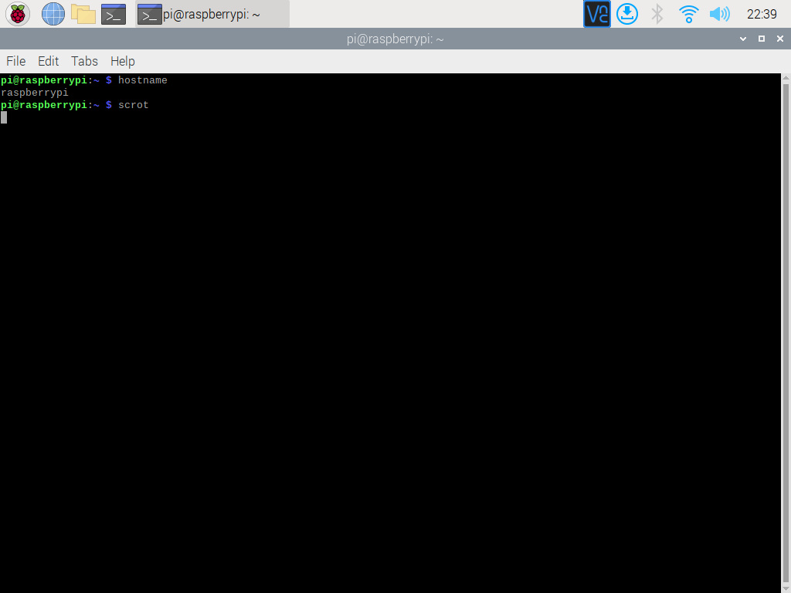

**ps**
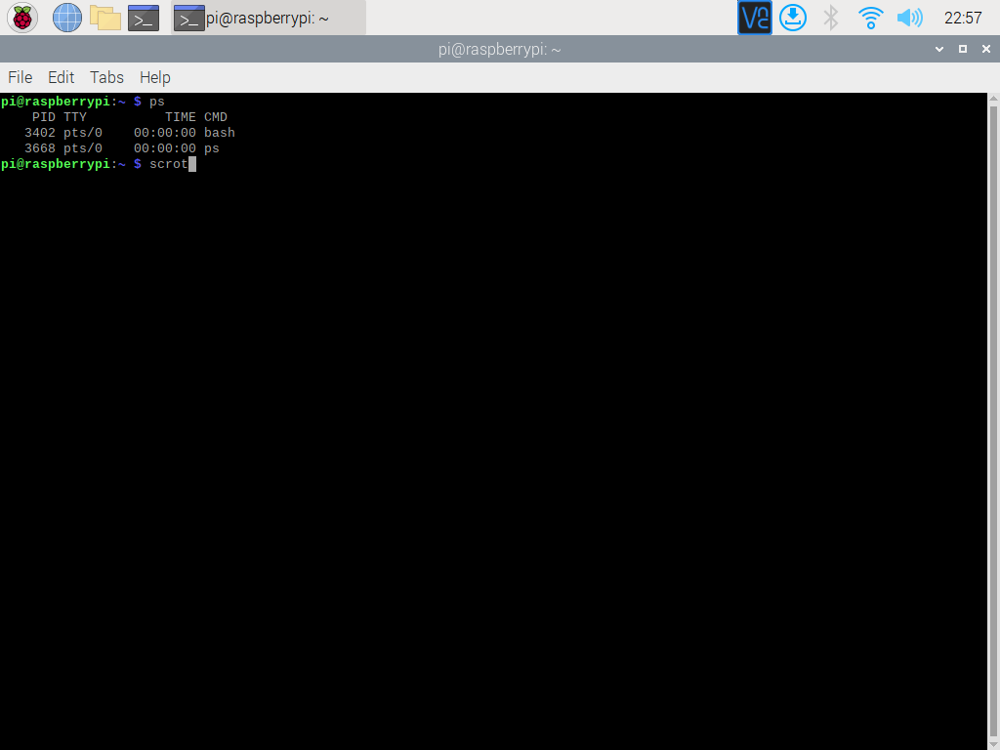

**pwd**
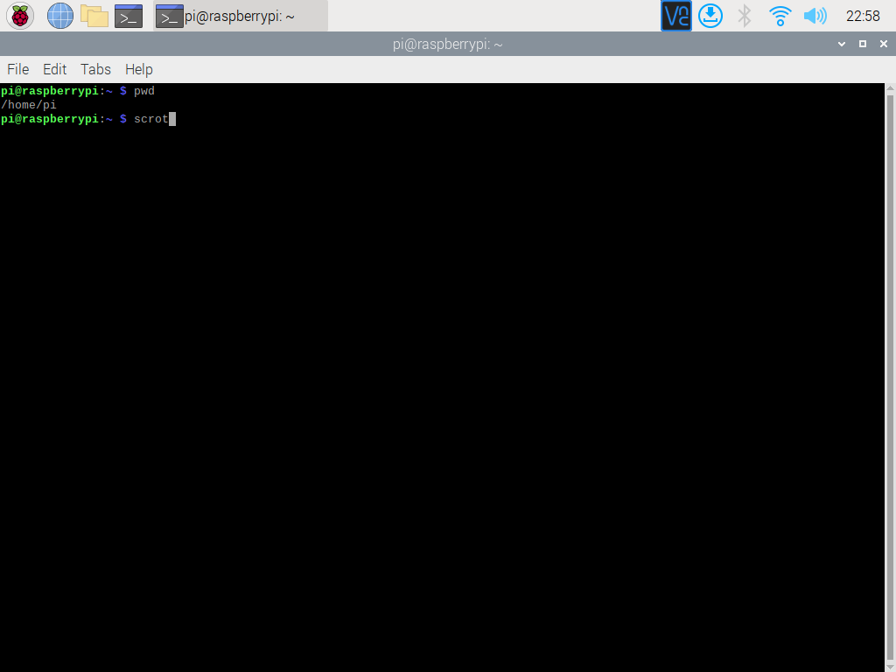

**git clone, cd iot, ls, cd**
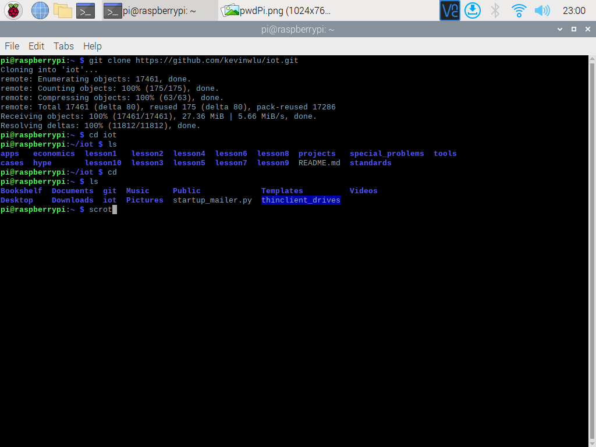

**df**
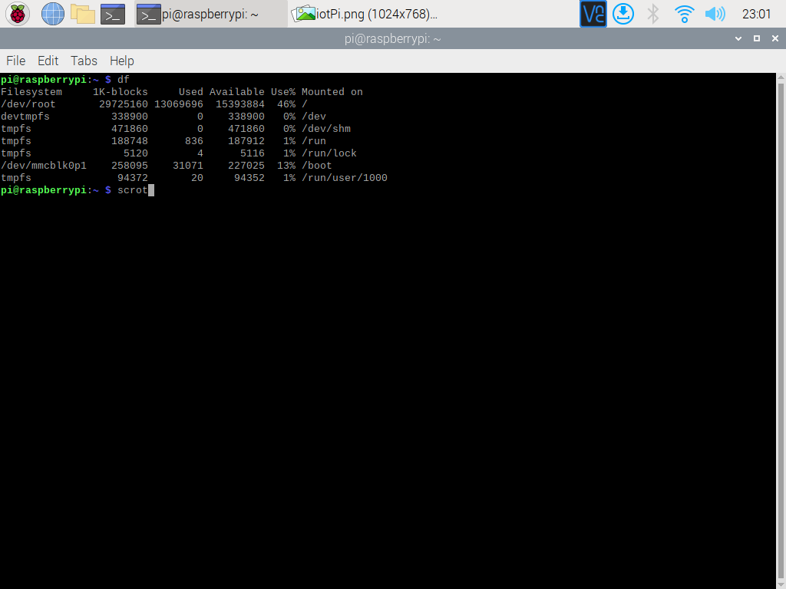

**mkdir, cd demo, cat file, cp, mv, rm**
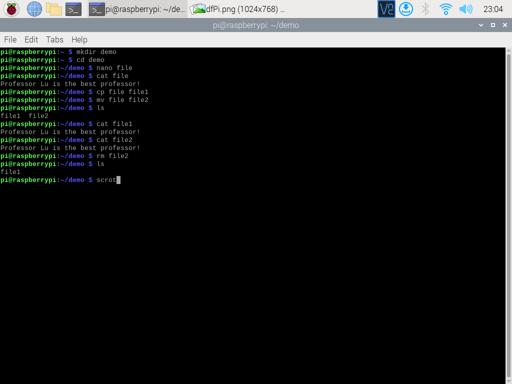

**nano file**
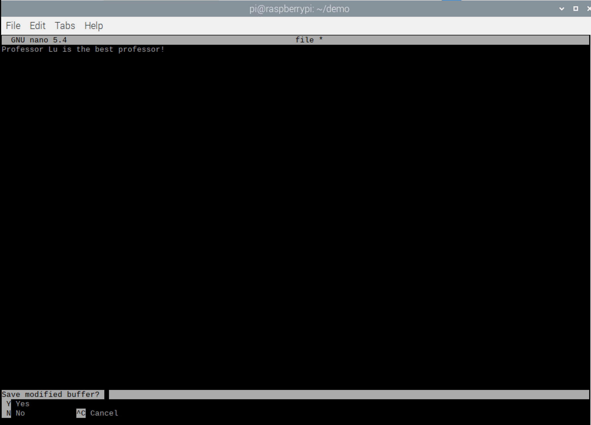

**uname -a**


**ifconfig**
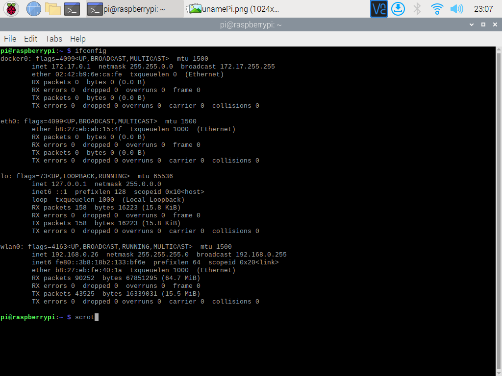

I have installed Docker from an [IoT lesson repo](https://github.com/kevinwlu/iot/tree/master/lesson8). Thus, this is why the Docker virtualization network interface shows up. </br>

**ping localhost**
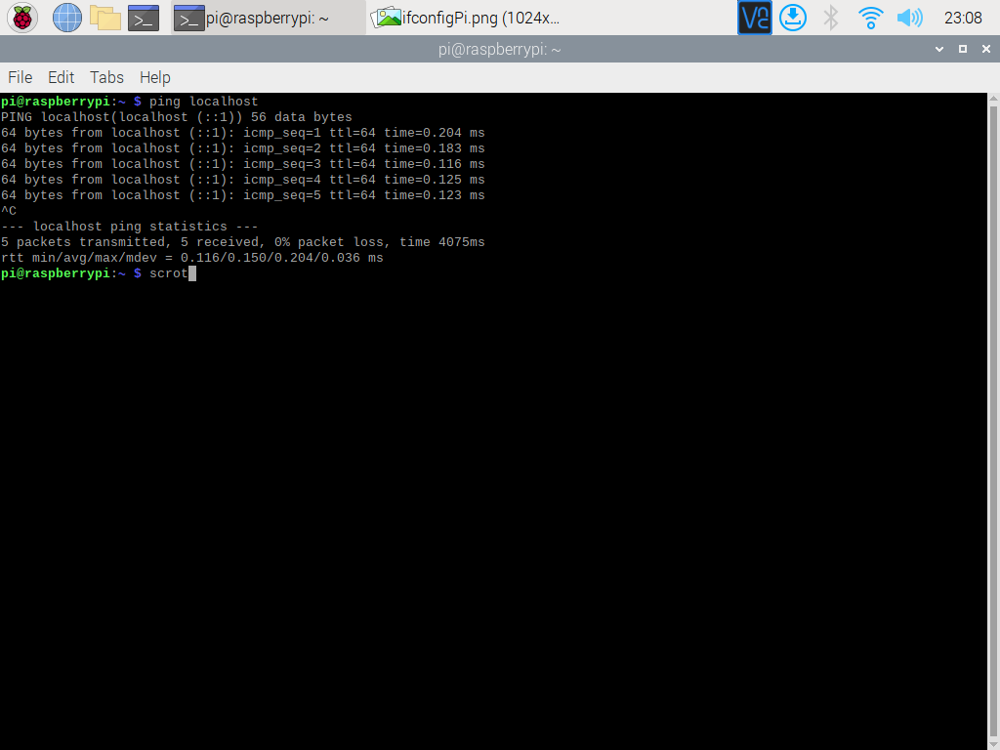

## Ubuntu Screenshots via Windows Susbsytem for Linux (WSL) from Snipping Tool on Windows*

*Note: Scrot can be done. I do not have the time to setup GitHub's SSH keys in order to allow for pushing commits. </br>

**hostname** </br>
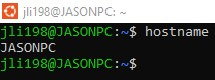

**ps** </br>
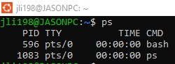

**pwd** </br>
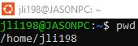

**git clone, cd iot, ls, cd** </br>
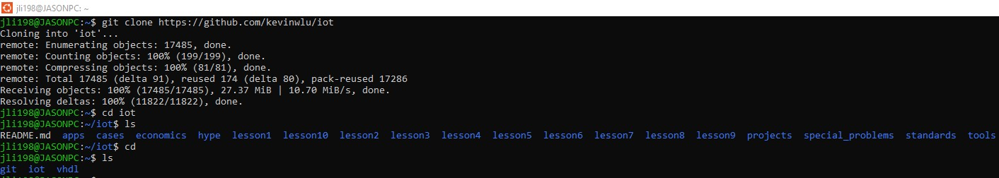

**df** </br>
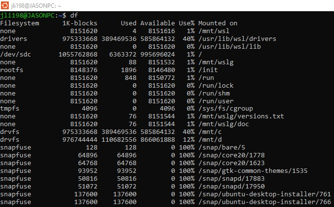

**mkdir, cd demo, cat file, cp, mv, rm** </br>
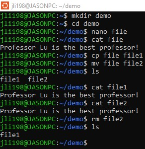

**nano file** </br>
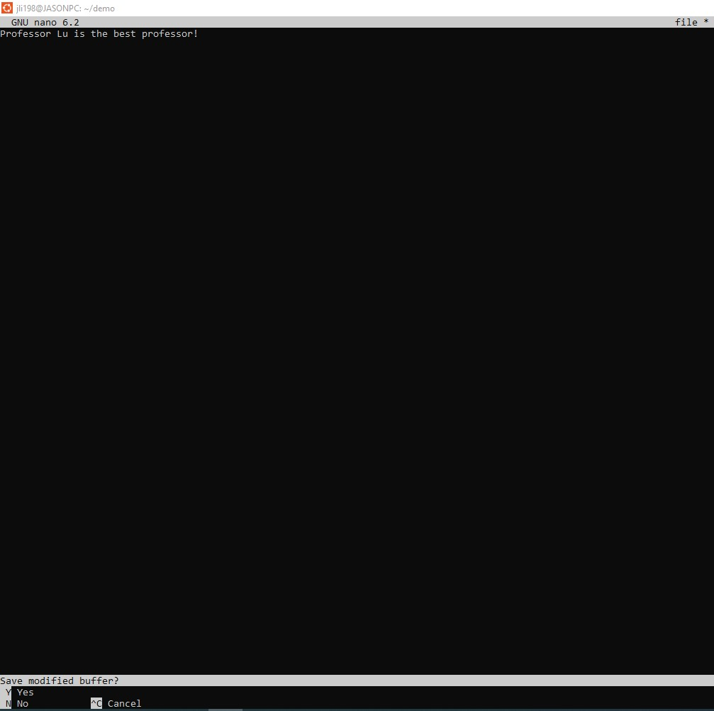

**uname -a** </br>
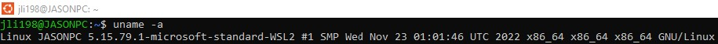

**ifconfig** </br>
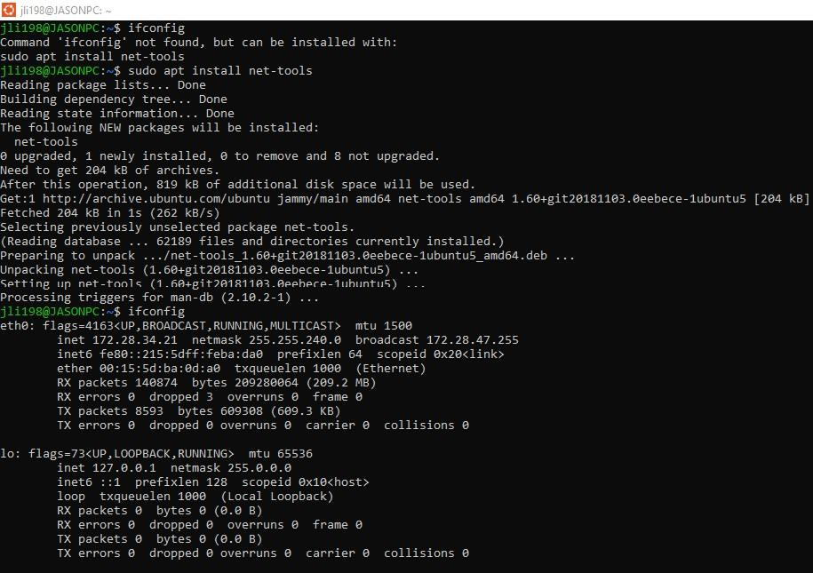 </br>
**Looks like ifconfig did not come preinstalled with my Ubuntu distribution via WSL. Unix made me install net-tools.** </br>

**ping localhost** </br>
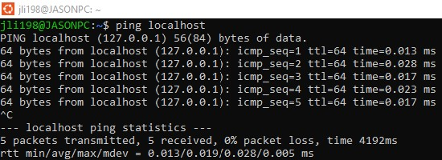
