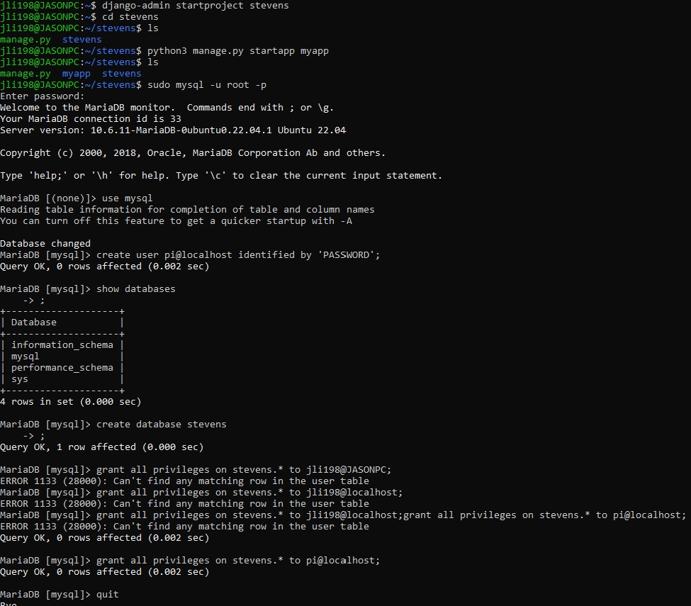
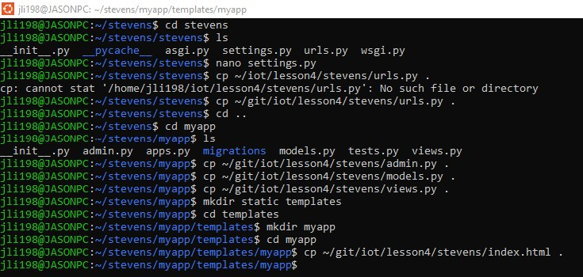
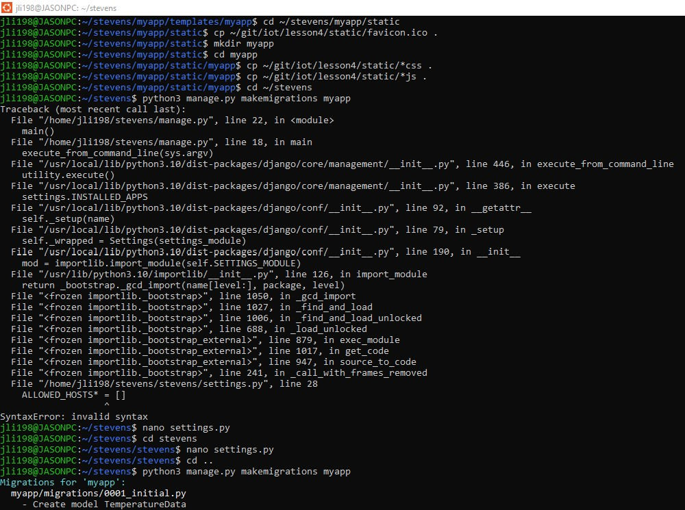
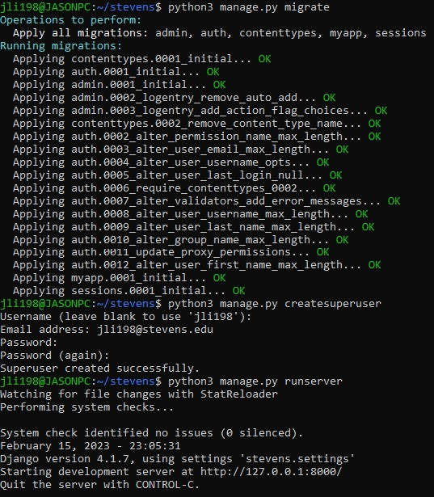
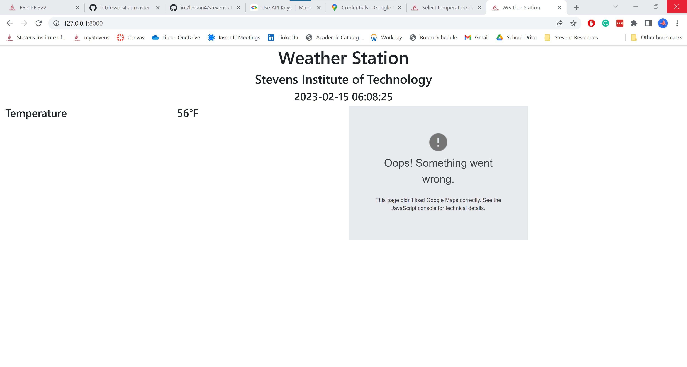
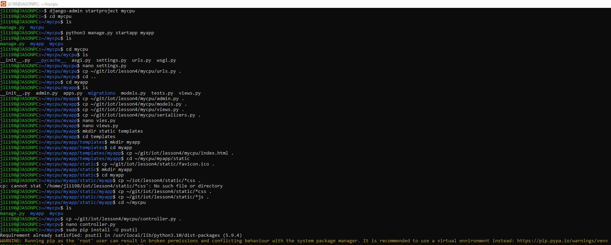
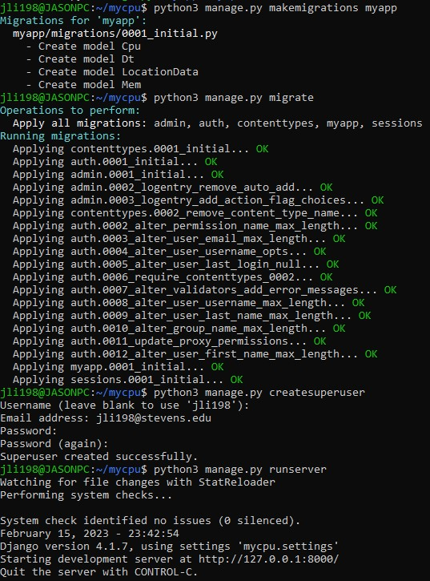
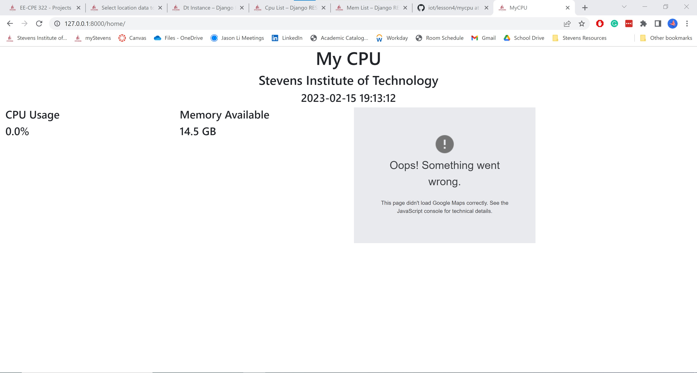
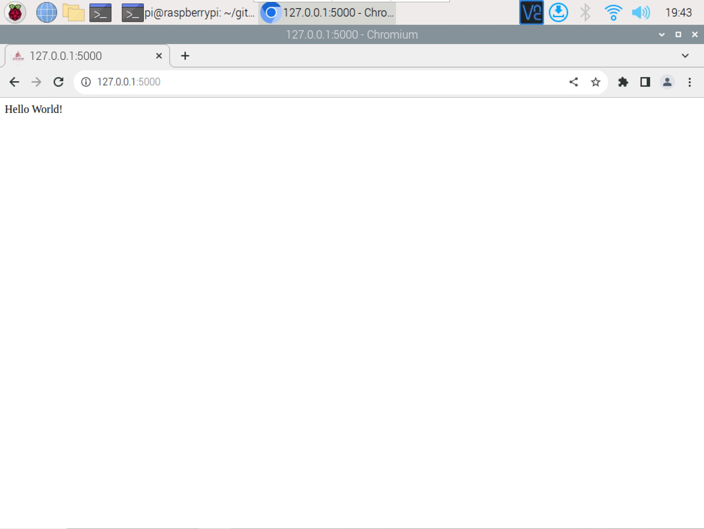

# Lab 4 - Django and Flask*

*Done on Ubuntu

* Study GitHub [repository](https://github.com/kevinwlu/iot/tree/master/lesson4) Lesson 4 labs
* Install Django and Djagno REST framework
* Start Django project "stevens," run server, and view app
* Start Django REST project "mycpu," run server, and view app
* Install Flask if no module named 'flask'
* Run Flask server via hello_world.py and view app

## Django Project "Stevens"

### Start a Django project

```sh
pi@raspberrypi:~ $ django-admin startproject stevens
pi@raspberrypi:~ $ cd stevens
pi@raspberrypi:~/stevens $ ls
manage.py  stevens
```

### Start a Django app

```sh
pi@raspberrypi:~/stevens $ python3 manage.py startapp myapp
pi@raspberrypi:~/stevens $ ls
manage.py  myapp  stevens
```

### Create MySQL database

* On Windows or macOS, use the default SQLite database instead of MariaDB

```sh
pi@raspberrypi:~ $ sudo mysql -u root -p
Enter password: PASSWORD
MariaDB [(none)]> use mysql
MariaDB [mysql]> select user, host from mysql.user;
MariaDB [mysql]> create user pi@localhost identified by 'PASSWORD';
MariaDB [mysql]> show databases;
MariaDB [mysql]> create database stevens;
MariaDB [mysql]> grant all privileges on stevens.* to pi@localhost;
MariaDB [mysql]> quit
```



### Edit settings.py in ~/stevens/stevens

* Follow ~/iot/lesson4/stevens/settings.txt, e.g., add an asterisk to ALLOWED_HOSTS and 'myapp' to INSTALLED_APPS
* The comma after 'myapp' is required
* Remember to change PASSWORD for MySQL user pi

```sh
pi@raspberrypi:~/stevens $ cd stevens
pi@raspberrypi:~/stevens/stevens $ ls
asgi.py  __init__.py  __pycache__  settings.py  urls.py  wsgi.py
pi@raspberrypi:~/stevens/stevens $ nano settings.py
```

### Copy urls.py to ~/stevens/stevens

```sh
pi@raspberrypi:~/stevens/stevens $ cp ~/iot/lesson4/stevens/urls.py .
pi@raspberrypi:~/stevens/stevens $ cd ..
```

### Copy admin.py, models.py, and views.py to ~/stevens/myapp

```sh
pi@raspberrypi:~/stevens $ cd myapp
pi@raspberrypi:~/stevens/myapp $ ls
admin.py  apps.py  __init__.py  migrations  models.py  tests.py  views.py
pi@raspberrypi:~/stevens/myapp $ cp ~/iot/lesson4/stevens/admin.py .
pi@raspberrypi:~/stevens/myapp $ cp ~/iot/lesson4/stevens/models.py .
pi@raspberrypi:~/stevens/myapp $ cp ~/iot/lesson4/stevens/views.py .
```

## Copy index.html

```sh
pi@raspberrypi:~/stevens/myapp $ mkdir static templates
pi@raspberrypi:~/stevens/myapp $ cd templates
pi@raspberrypi:~/stevens/myapp/templates $ mkdir myapp
pi@raspberrypi:~/stevens/myapp/templates $ cd myapp
pi@raspberrypi:~/stevens/myapp/templates/myapp $ cp ~/iot/lesson4/stevens/index.html .
```



## Enable Google Maps API*

***Note: Google Maps API charges so it can't be implemented in this lab version.**

[Application programming interface](https://en.wikipedia.org/wiki/Application_programming_interface) (API)

https://cloud.google.com/maps-platform

https://developers.google.com/maps/documentation/javascript/get-api-key

https://churchthemes.com/page-didnt-load-google-maps-correctly

### Edit index.html to add the Google Maps API key

* Without a valid API key, the map is darkened and watermarked with “this page didn’t load Google maps correctly”
* Substitute YOUR_API_KEY in index.html with the API key

```sh
pi@raspberrypi:~/stevens/myapp/templates/myapp $ nano index.html
<script src="https://maps.googleapis.com/maps/api/js?key=YOUR_API_KEY"></script>
```

### Copy static files

```sh
pi@raspberrypi:~/stevens/myapp/templates/myapp $ cd ~/stevens/myapp/static
pi@raspberrypi:~/stevens/myapp/static $ cp ~/iot/lesson4/static/favicon.ico .
pi@raspberrypi:~/stevens/myapp/static $ mkdir myapp
pi@raspberrypi:~/stevens/myapp/static $ cd myapp
pi@raspberrypi:~/stevens/myapp/static/myapp $ cp ~/iot/lesson4/static/*css .
pi@raspberrypi:~/stevens/myapp/static/myapp $ cp ~/iot/lesson4/static/*js .
pi@raspberrypi:~/stevens/myapp/static/myapp $ cd ~/stevens
```

### After the first time, skip these three steps if no changes

* Using Git for Windows, if "python manage.py createsuperuser" leads to "Superuser creation skipped due to not running in a TTY," enter "winpty python manage.py createsuperuser"

```sh
pi@raspberrypi:~/stevens $ python3 manage.py makemigrations myapp
pi@raspberrypi:~/stevens $ python3 manage.py migrate
pi@raspberrypi:~/stevens $ python3 manage.py createsuperuser
Username (leave blank to use 'pi'):
Email address: EMAIL_ADDRESS
Password: PASSWORD
Password (again): PASSWORD
Superuser created successfully.
```



### Run Django server

```sh
pi@raspberrypi:~/stevens $ python3 manage.py runserver
```



### Open the Chromium browser on Raspberry Pi via VNC Viewer

#### Go to http://127.0.0.1:8000/admin

#### Login with Django administration username (pi) and password

#### Click temperature data to add

* Date and time in YYYY-MM-DD HH:MM:SS

* Temperature in Fahrenheit

* Latitude 40.7451

* Longitude -74.0255

**Click SAVE**
**View app at http://127.0.0.1:8000**
**On Raspberry Pi with an asterisk in ALLOWED_HOSTS of settings.py, run Django server at [0.0.0.0](https://en.wikipedia.org/wiki/0.0.0.0):8000**

```sh
pi@raspberrypi:~/stevens $ python3 manage.py runserver 0.0.0.0:8000
```

### Open a laptop browser and go to the Raspbbery Pi IP address as opposed to the localhost



## Drango REST Project "MyCPU"

### Start a Django project (MyCPU)

```sh
~ $ django-admin startproject mycpu
~ $ cd mycpu
~/mycpu $ ls
manage.py  mycpu/
```

### Start a Django app (MyCPU)

* Run python3 on Raspberry Pi OS

```sh
~/mycpu $ python manage.py startapp myapp
~/mycpu $ ls
manage.py  myapp/  mycpu/
```

### Edit settings.py in ~/mycpu/mycpu

* Follow ~/iot/lesson4/mycpu/settings.txt, e.g., add an asterisk to ALLOWED_HOSTS and 'myapp' and 'rest_framework' to INSTALLED_APPS
* The comma after 'rest_framework' is required

```sh
~/mycpu $ cd mycpu
~/mycpu/mycpu $ ls
asgi.py  __init__.py  __pycache__  settings.py  urls.py  wsgi.py
~/mycpu/mycpu $ nano settings.py
```

### Copy urls.py to ~/mycpu/mycpu

```sh
~/mycpu/mycpu $ cp ~/iot/lesson4/mycpu/urls.py .
~/mycpu/mycpu $ cd ..
```

### Copy admin.py, models.py, views.py, and serializers.py to ~/mycpu/myapp

```sh
~/mycpu $ cd myapp
~/mycpu/myapp $ ls
admin.py  apps.py  __init__.py  migrations  models.py  tests.py  views.py
~/mycpu/myapp $ cp ~/iot/lesson4/mycpu/admin.py .
~/mycpu/myapp $ cp ~/iot/lesson4/mycpu/models.py .
~/mycpu/myapp $ cp ~/iot/lesson4/mycpu/views.py .
~/mycpu/myapp $ cp ~/iot/lesson4/mycpu/serializers.py .
```

### Change the default password 'admin' in views.py

```sh
~/mycpu/myapp $ nano views.py
```

### Copy index.html (MyCPU)

* Default location: Stevens Institute of Technology

```sh
~/mycpu/myapp $ mkdir static templates
~/mycpu/myapp $ cd templates
~/mycpu/myapp/templates $ mkdir myapp
~/mycpu/myapp/templates $ cd myapp
~/mycpu/myapp/templates/myapp $ cp ~/iot/lesson4/mycpu/index.html .
```

### Edit index.html to add the Google Maps API key (MyCPU)

* [Application programming interface](https://en.wikipedia.org/wiki/Application_programming_interface) (API)
* [Google Maps Platform](https://cloud.google.com/maps-platform)
* [Get Google Maps API Key](https://developers.google.com/maps/documentation/javascript/get-api-key)
* [How to fix “This page didn’t load Google Maps correctly” error](https://churchthemes.com/page-didnt-load-google-maps-correctly)
* Alternatively, use [Amap API](https://lbs.amap.com/) that requires registration with a cellphone number in China
  * [AutoNavi](https://en.wikipedia.org/wiki/AutoNavi)
  * [Guide](https://lbs.amap.com/api/javascript-api/guide/abc/prepare)

```sh
~/mycpu/myapp/templates/myapp $ nano index.html
```

### Copy static files (MyCPU)

* Stevens favicon: ~/iot/lesson4/static/favicon.ico
* Xidian favicon: ~/iot/lesson4/static/xidian/favicon.ico

```sh
~/mycpu/myapp/templates/myapp $ cd ~/mycpu/myapp/static
~/mycpu/myapp/static $ cp ~/iot/lesson4/static/favicon.ico .
~/mycpu/myapp/static $ mkdir myapp
~/mycpu/myapp/static $ cd myapp
~/mycpu/myapp/static/myapp $ cp ~/iot/lesson4/static/*css .
~/mycpu/myapp/static/myapp $ cp ~/iot/lesson4/static/*js .
~/mycpu/myapp/static/myapp $ cd ~/mycpu
```

### Copy controller.py to ~/mycpu

```sh
~/mycpu $ ls
db.sqlite3  manage.py  myapp/  mycpu/
~/mycpu $ cp ~/iot/lesson4/mycpu/controller.py .
```

### Change the default password 'admin' in controller.py

```sh
~/mycpu $ nano controller.py
```

### If haven't done so, install (or upgrade) psutil (process and system utilities)

* Run pip3 on Raspberry Pi OS

```sh
~/mycpu $ sudo pip install -U psutil
```



### After the first time, skip these three steps if no changes (MyCPU)

* Run python3 on Raspberry Pi OS
* Using Git for Windows, if "python manage.py createsuperuser" leads to "Superuser creation skipped due to not running in a TTY," enter "winpty python manage.py createsuperuser"

```sh
~/mycpu $ python manage.py makemigrations myapp
~/mycpu $ python manage.py migrate
~/mycpu $ python manage.py createsuperuser
Username (leave blank to use '_'): admin
Email address: EMAIL_ADDRESS
Password: admin
Password (again): admin
The password is too similar to the username.
This password is too short. It must contain at least 8 characters.
This password is too common.
Bypass password validation and create user anyway? [y/N]: y
Superuser created successfully.
```

### Run Django server (MyCPU)

```sh
~/mycpu $ python manage.py runserver
```



### Open a browser

**At the first time, go to http://127.0.0.1:8000/admin**
**Login with Django administration username (admin) and password (admin)**
**Click location data to add one of the following**

* Location Stevens
  * Latitude 40.7451
  * Longitude -74.0255
* Location Xidian
  * Latitude 34.12250
  * Longitude 108.84029
**Click SAVE**

**Post the following in HTML form:**

* 2022 to the Dt List at http://127.0.0.1:8000/dt
* 20 to the Cpu List at http://127.0.0.1:8000/cpu
* 20 to the Mem List at http://127.0.0.1:8000/mem

### Run native controller service on a separate terminal window

* If using Git for Windows, enter "winpty python controller.py"

```sh
~/mycpu $ python controller.py
```

### View app at http://127.0.0.1:8000/home

### Alternatively, run Django server at [0.0.0.0](https://en.wikipedia.org/wiki/0.0.0.0):8000

```sh
~/mycpu $ python manage.py runserver 0.0.0.0:8000
```

### Open a browser on another laptop and go to the server IP address



## Flask

