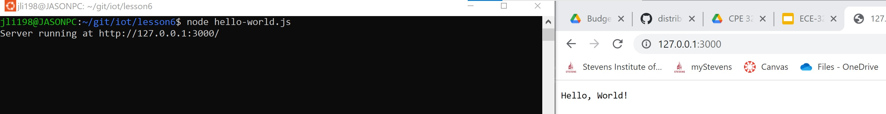
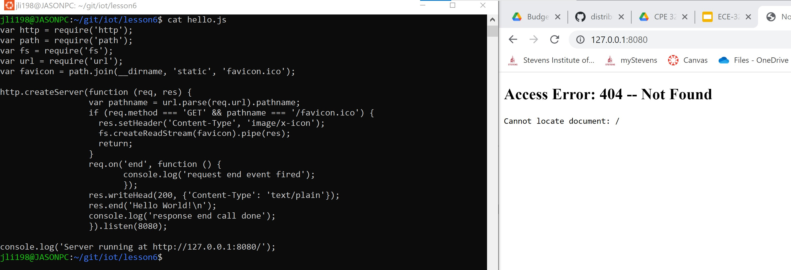
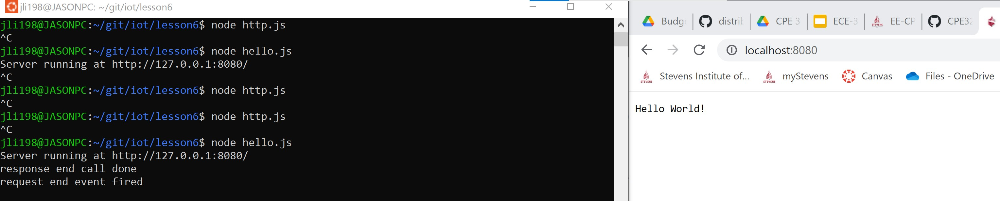
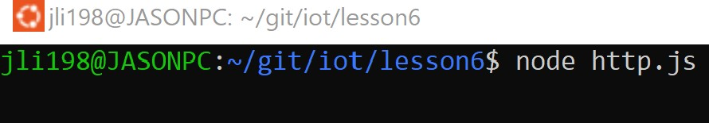
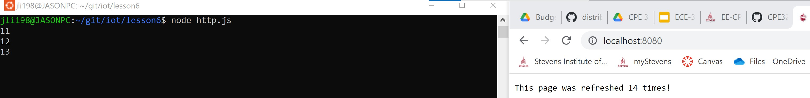
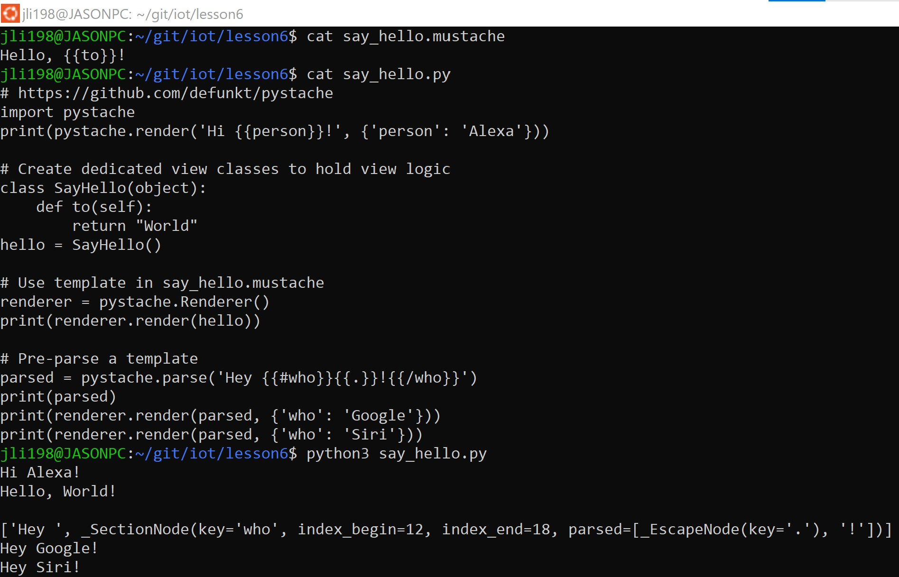

# Lab 6 - Node.js and Pystache

* Study GitHub repository Lesson 6
* Install Node.js and run hello-world.js, hello.js, and http.js
* Install Pystache and run say_hello.py that uses template in say_hello.mustache

## Install NodeJS (Ubuntu)

[Install NodeJS via Packet Manager](https://github.com/nodesource/distributions/blob/master/README.md#debian-and-ubuntu-based-distributions) </br>
</br>

```sh
$ curl -fsSL https://deb.nodesource.com/setup_19.x | sudo -E bash - &&\
sudo apt-get install -y nodejs
```

### Confirm Installation

```sh
$ node
Welcome to Node.js v19.7.0.
Type ".help" for more information.
>
(To exit, press Ctrl+C again or Ctrl+D or type .exit)
> .exit
```

### Run hello-world.js (Ubuntu)



### Run hello.js (Ubuntu)



Looks like it can't access the document. From what I've heard from [Professor Wellerstein](https://alexwellerstein.com/) in HST 325 Visualizing Society, this is a security protection as someone could spoof a domain and access files via Node. Let's try using localhost. </br>
</br>



holy freaking bingle, it worked!

### Run http.js (Ubuntu)

What? It's doing nothing!



Let's access the localhost again. </br>
Oh! It lists how many times it refreshes! Clever!



## Install Pystache (Ubuntu)

```sh
$ sudo pip3 install pystache
Collecting pystache
  Downloading pystache-0.6.0.tar.gz (78 kB)
     ━━━━━━━━━━━━━━━━━━━━━━━━━━━━━━━━━━━━━━━━ 78.2/78.2 KB 3.9 MB/s eta 0:00:00
  Installing build dependencies ... done
  Getting requirements to build wheel ... done
  Preparing metadata (pyproject.toml) ... done
Building wheels for collected packages: pystache
  Building wheel for pystache (pyproject.toml) ... done
  Created wheel for pystache: filename=pystache-0.6.0-py3-none-any.whl size=83635 sha256=b83f453b7f281d0a9449db1b9fc2e483cf25a6e82e47f8c6860bf93623180430
  Stored in directory: /root/.cache/pip/wheels/4a/98/2c/84a50139380b5a5d8c0b4dfb92f2d860953c9e8e755507a402
Successfully built pystache
Installing collected packages: pystache
Successfully installed pystache-0.6.0
WARNING: Running pip as the 'root' user can result in broken permissions and conflicting behaviour with the system package manager. It is recommended to use a virtual environment instead: https://pip.pypa.io/warnings/venv
```

### Run Say Hello and its Mustache Counterpart (Ubuntu)


