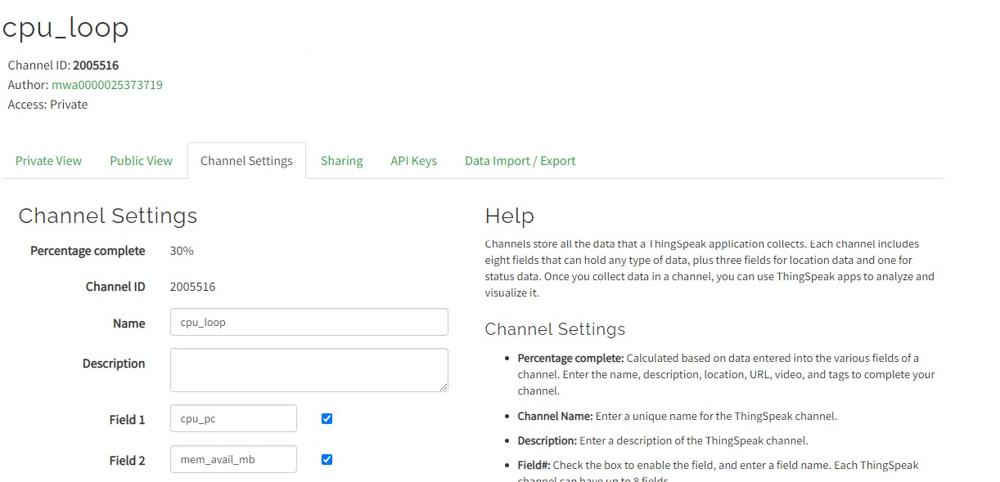

# Lab 7 - ThingSpeak and Google Sheets

* Study GitHub [repository](https://github.com/kevinwlu/iot/tree/master/lesson7) Lesson 7
* Sign up and log in MathWorks ThingSpeak
* Run thingspeak_cpu_loop.py or thinkspeak_feed.py in demo folder
* Install gspread and oauth2client
* Log in Google Cloud Platform Identity and Access Maanagement, create project cpudata, enable both Drive API and Sheets API, create and download service account JSON key file
* Start new Google sheet cpudata, share it with client email in JSON file, delete Rows 2 to 1000, and edit header cells
* Run cpu_spreadsheet.py with JSON key file in demo folder

## MathWorks ThingSpeak



### ThingSpeak (Raspberry Pi)*

*Note: I first did this exercise on 2023-01-12


## Install gspread and oauth2client (Raspberry Pi)

```sh
$ sudo pip3 install -U gspread oauth2client
Looking in indexes: https://pypi.org/simple, https://www.piwheels.org/simple
Requirement already satisfied: gspread in /usr/local/lib/python3.9/dist-packages (5.7.2)
Collecting gspread
  Using cached https://www.piwheels.org/simple/gspread/gspread-5.7.2-py3-none-any.whl (40 kB)
  Downloading https://www.piwheels.org/simple/gspread/gspread-5.7.1-py3-none-any.whl (40 kB)
     |████████████████████████████████| 40 kB 324 kB/s 
Requirement already satisfied: oauth2client in /usr/local/lib/python3.9/dist-packages (4.1.3)
Collecting oauth2client
  Using cached https://www.piwheels.org/simple/oauth2client/oauth2client-4.1.3-py2.py3-none-any.whl (98 kB)
  Downloading https://www.piwheels.org/simple/oauth2client/oauth2client-4.1.2-py2.py3-none-any.whl (99 kB)
     |████████████████████████████████| 99 kB 441 kB/s 
Requirement already satisfied: google-auth-oauthlib>=0.4.1 in /usr/local/lib/python3.9/dist-packages (from gspread) (0.8.0)
Requirement already satisfied: google-auth>=1.12.0 in /usr/local/lib/python3.9/dist-packages (from gspread) (2.16.0)
Requirement already satisfied: pyasn1-modules>=0.2.1 in /usr/local/lib/python3.9/dist-packages (from google-auth>=1.12.0->gspread) (0.2.8)
Requirement already satisfied: cachetools<6.0,>=2.0.0 in /usr/local/lib/python3.9/dist-packages (from google-auth>=1.12.0->gspread) (5.2.1)
Requirement already satisfied: six>=1.9.0 in /usr/local/lib/python3.9/dist-packages (from google-auth>=1.12.0->gspread) (1.11.0)
Requirement already satisfied: rsa<5,>=3.1.4 in /usr/local/lib/python3.9/dist-packages (from google-auth>=1.12.0->gspread) (4.9)
Requirement already satisfied: requests-oauthlib>=0.7.0 in /usr/lib/python3/dist-packages (from google-auth-oauthlib>=0.4.1->gspread) (1.0.0)
Requirement already satisfied: pyasn1<0.5.0,>=0.4.6 in /usr/local/lib/python3.9/dist-packages (from pyasn1-modules>=0.2.1->google-auth>=1.12.0->gspread) (0.4.8)
Requirement already satisfied: httplib2>=0.9.1 in /usr/local/lib/python3.9/dist-packages (from oauth2client) (0.21.0)
Requirement already satisfied: pyparsing!=3.0.0,!=3.0.1,!=3.0.2,!=3.0.3,<4,>=2.4.2 in /usr/local/lib/python3.9/dist-packages (from httplib2>=0.9.1->oauth2client) (3.0.9)
```

## Install gspread and oauth2client (Ubuntu)

```sh
$ sudo pip3 install -U gspread oauth2client
Collecting gspread
  Downloading gspread-5.7.2-py3-none-any.whl (40 kB)
     ━━━━━━━━━━━━━━━━━━━━━━━━━━━━━━━━━━━━━━━━ 40.5/40.5 KB 993.6 kB/s eta 0:00:00
Collecting oauth2client
  Downloading oauth2client-4.1.3-py2.py3-none-any.whl (98 kB)
     ━━━━━━━━━━━━━━━━━━━━━━━━━━━━━━━━━━━━━━━━ 98.2/98.2 KB 3.6 MB/s eta 0:00:00
Requirement already satisfied: google-auth>=1.12.0 in /usr/local/lib/python3.10/dist-packages (from gspread) (2.16.0)
Requirement already satisfied: google-auth-oauthlib>=0.4.1 in /usr/local/lib/python3.10/dist-packages (from gspread) (0.4.6)
Requirement already satisfied: pyasn1-modules>=0.0.5 in /usr/local/lib/python3.10/dist-packages (from oauth2client) (0.2.8)
Requirement already satisfied: six>=1.6.1 in /usr/lib/python3/dist-packages (from oauth2client) (1.16.0)
Requirement already satisfied: pyasn1>=0.1.7 in /usr/local/lib/python3.10/dist-packages (from oauth2client) (0.4.8)
Requirement already satisfied: httplib2>=0.9.1 in /usr/lib/python3/dist-packages (from oauth2client) (0.20.2)
Requirement already satisfied: rsa>=3.1.4 in /usr/local/lib/python3.10/dist-packages (from oauth2client) (4.9)
Requirement already satisfied: cachetools<6.0,>=2.0.0 in /usr/local/lib/python3.10/dist-packages (from google-auth>=1.12.0->gspread) (5.2.1)
Requirement already satisfied: requests-oauthlib>=0.7.0 in /usr/local/lib/python3.10/dist-packages (from google-auth-oauthlib>=0.4.1->gspread) (1.3.1)
Requirement already satisfied: pyparsing!=3.0.0,!=3.0.1,!=3.0.2,!=3.0.3,<4,>=2.4.2 in /usr/lib/python3/dist-packages (from httplib2>=0.9.1->oauth2client) (2.4.7)
Requirement already satisfied: requests>=2.0.0 in /usr/local/lib/python3.10/dist-packages (from requests-oauthlib>=0.7.0->google-auth-oauthlib>=0.4.1->gspread) (2.28.2)
Requirement already satisfied: oauthlib>=3.0.0 in /usr/lib/python3/dist-packages (from requests-oauthlib>=0.7.0->google-auth-oauthlib>=0.4.1->gspread) (3.2.0)
Requirement already satisfied: charset-normalizer<4,>=2 in /usr/local/lib/python3.10/dist-packages (from requests>=2.0.0->requests-oauthlib>=0.7.0->google-auth-oauthlib>=0.4.1->gspread) (3.0.1)
Requirement already satisfied: urllib3<1.27,>=1.21.1 in /usr/local/lib/python3.10/dist-packages (from requests>=2.0.0->requests-oauthlib>=0.7.0->google-auth-oauthlib>=0.4.1->gspread) (1.26.14)
Requirement already satisfied: certifi>=2017.4.17 in /usr/local/lib/python3.10/dist-packages (from requests>=2.0.0->requests-oauthlib>=0.7.0->google-auth-oauthlib>=0.4.1->gspread) (2022.12.7)
Requirement already satisfied: idna<4,>=2.5 in /usr/local/lib/python3.10/dist-packages (from requests>=2.0.0->requests-oauthlib>=0.7.0->google-auth-oauthlib>=0.4.1->gspread) (3.4)
Installing collected packages: oauth2client, gspread
Successfully installed gspread-5.7.2 oauth2client-4.1.3
WARNING: Running pip as the 'root' user can result in broken permissions and conflicting behaviour with the system package manager. It is recommended to use a virtual environment instead: https://pip.pypa.io/warnings/venv
```

## Google Cloud Platform Identity and Access Management

### cpudata Google sheet

[Google Sheet](https://docs.google.com/spreadsheets/d/1aaAv8jCtFTA9eNsab3ZEvfJGuYb_dVtfE7GiKSauwXs/edit?usp=sharing)

### cpu_spreadsheet.py (Raspberry Pi)*

*Completed on 2023-01-11

[Data in Google Sheet](https://docs.google.com/spreadsheets/d/1aaAv8jCtFTA9eNsab3ZEvfJGuYb_dVtfE7GiKSauwXs/edit?usp=sharing)
