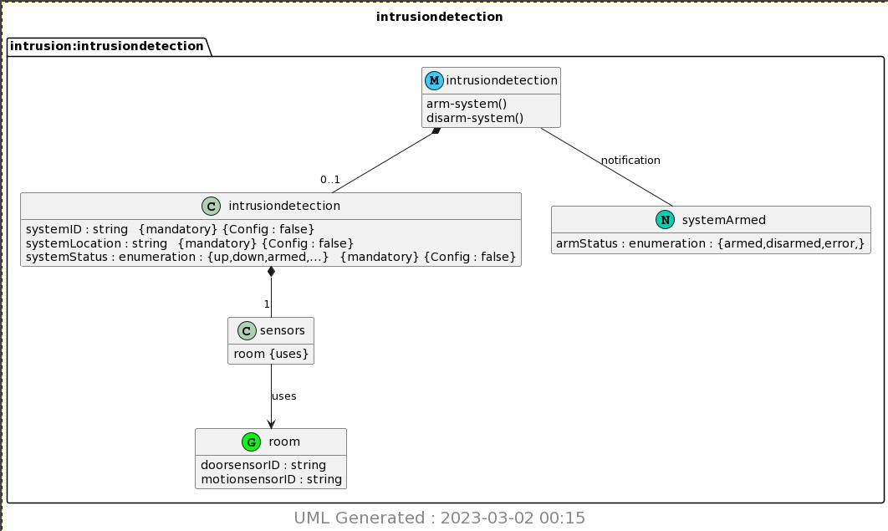

# Lab 9 - Yang

* Study GitHub [repository](https://github.com/kevinwlu/iot/tree/master/lesson9) Lesson 9
* Install pyang and PlantUML
* copy ~/iot/lesson9/intrusiondetection.yang to ~/demo
* Run pyang to generate intrusiondetection.yin and intrusiondetection.uml
* Run PlantUML to generate intrusiondetection.png

## Install pyang and PlantUML (Ubuntu)

```sh
$ sudo pip3 install pyang plantuml
Requirement already satisfied: pyang in /usr/local/lib/python3.10/dist-packages (2.5.3)
Requirement already satisfied: plantuml in /usr/local/lib/python3.10/dist-packages (0.3.0)
Requirement already satisfied: lxml in /usr/local/lib/python3.10/dist-packages (from pyang) (4.9.2)
Requirement already satisfied: httplib2 in /usr/lib/python3/dist-packages (from plantuml) (0.20.2)
Requirement already satisfied: pyparsing!=3.0.0,!=3.0.1,!=3.0.2,!=3.0.3,<4,>=2.4.2 in /usr/lib/python3/dist-packages (from httplib2->plantuml) (2.4.7)
WARNING: Running pip as the 'root' user can result in broken permissions and conflicting behaviour with the system package manager. It is recommended to use a virtual environment instead: https://pip.pypa.io/warnings/venv
```

## Run pyang -> generate intrusiondetection.yin and intrusiondetection.uml (Ubuntu)

```sh
$ cat intrusiondetection.yang
module intrusiondetection {

 namespace "http://netconfcentral.org/ns/intrusiondetection";

 prefix "intrusion";

 description
  "YANG module for Intrusion Detection IoT system";

 revision 2014-07-15 {
  description "Intrusion Detection System";
 }

 grouping room {
  leaf doorsensorID {
   type string;
   description
    "ID of door sensor in the room";
  }
  leaf motionsensorID {
   type string;
   description
    "ID of motion sensor in the room";
  }
 }

 container intrusiondetection {
  presence
   "Indicates the service is available";

  description
   "Top-level container for all system objects.";

  leaf systemID {
   type string;
   config false;
   mandatory true;
   description
   "ID of the system";
  }

  leaf systemLocation {
   type string;
   config false;
   mandatory true;
   description
   "The location of the system";
  }

  leaf systemStatus {
   type enumeration {
    enum up {
    value 1;
    description
     "This is powered up";
    }
    enum down {
    value 2;
    description
     "This is powered down";
    }
    enum armed {
    value 3;
    description
     "This is armed";
    }
    enum disarmed {
    value 4;
    description
     "This is disarmed";
    }
   }
   config false;
   mandatory true;
   description
   "This variable indicates the current state of
    the system.";
  }
    container sensors {
   uses room;
   config false;
  }
 }

 rpc arm-system {
  description
   "Arm the system";
 }

 rpc disarm-system {
  description
   "Disarm the system";
 }

 notification systemArmed {
  description
   "Indicates that system has been armed.";

  leaf armStatus {
   description
    "Indicates the system arming status";

   type enumeration {
    enum armed {
    description
     "The system was armed.";
    }

    enum disarmed {
    description
     "The system was disarmed.";
    }

    enum error {
    description
     "The system is broken.";
    }
   }
  }
 }
}
```

Running `pyang -f yin -o intrusiondetection.yin intrusiondetection.yang` will create intrusiondetection.yin

```sh
$ cat intrusiondetection.yin
<?xml version="1.0" encoding="UTF-8"?>
<module name="intrusiondetection"
        xmlns="urn:ietf:params:xml:ns:yang:yin:1"
        xmlns:intrusion="http://netconfcentral.org/ns/intrusiondetection">
  <namespace uri="http://netconfcentral.org/ns/intrusiondetection"/>
  <prefix value="intrusion"/>
  <description>
    <text>YANG module for Intrusion Detection IoT system</text>
  </description>
  <revision date="2014-07-15">
    <description>
      <text>Intrusion Detection System</text>
    </description>
  </revision>
  <grouping name="room">
    <leaf name="doorsensorID">
      <type name="string"/>
      <description>
        <text>ID of door sensor in the room</text>
      </description>
    </leaf>
    <leaf name="motionsensorID">
      <type name="string"/>
      <description>
        <text>ID of motion sensor in the room</text>
      </description>
    </leaf>
  </grouping>
  <container name="intrusiondetection">
    <presence value="Indicates the service is available"/>
    <description>
      <text>Top-level container for all system objects.</text>
    </description>
    <leaf name="systemID">
      <type name="string"/>
      <config value="false"/>
      <mandatory value="true"/>
      <description>
        <text>ID of the system</text>
      </description>
    </leaf>
    <leaf name="systemLocation">
      <type name="string"/>
      <config value="false"/>
      <mandatory value="true"/>
      <description>
        <text>The location of the system</text>
      </description>
    </leaf>
    <leaf name="systemStatus">
      <type name="enumeration">
        <enum name="up">
          <value value="1"/>
          <description>
            <text>This is powered up</text>
          </description>
        </enum>
        <enum name="down">
          <value value="2"/>
          <description>
            <text>This is powered down</text>
          </description>
        </enum>
        <enum name="armed">
          <value value="3"/>
          <description>
            <text>This is armed</text>
          </description>
        </enum>
        <enum name="disarmed">
          <value value="4"/>
          <description>
            <text>This is disarmed</text>
          </description>
        </enum>
      </type>
      <config value="false"/>
      <mandatory value="true"/>
      <description>
        <text>This variable indicates the current state of
the system.</text>
      </description>
    </leaf>
    <container name="sensors">
      <uses name="room"/>
      <config value="false"/>
    </container>
  </container>
  <rpc name="arm-system">
    <description>
      <text>Arm the system</text>
    </description>
  </rpc>
  <rpc name="disarm-system">
    <description>
      <text>Disarm the system</text>
    </description>
  </rpc>
  <notification name="systemArmed">
    <description>
      <text>Indicates that system has been armed.</text>
    </description>
    <leaf name="armStatus">
      <description>
        <text>Indicates the system arming status</text>
      </description>
      <type name="enumeration">
        <enum name="armed">
          <description>
            <text>The system was armed.</text>
          </description>
        </enum>
        <enum name="disarmed">
          <description>
            <text>The system was disarmed.</text>
          </description>
        </enum>
        <enum name="error">
          <description>
            <text>The system is broken.</text>
          </description>
        </enum>
      </type>
    </leaf>
  </notification>
</module>
```

Running `pyang -f uml -o intrusiondetection.uml intrusiondetection.yang --uml-no=stereotypes,annotation,typedef` will create intrusiondetection.uml

```sh
$ cat intrusiondetection.uml
'Download plantuml from http://plantuml.sourceforge.net/
'Generate png with java -jar plantuml.jar <file>
'Output in img/<module>.png
'If Java spits out memory error increase heap size with java -Xmx1024m  -jar plantuml.jar <file>
@startuml img/intrusiondetection.png
hide empty fields
hide empty methods
hide <<case>> circle
hide <<augment>> circle
hide <<choice>> circle
hide <<leafref>> stereotype
hide <<leafref>> circle
hide stereotypes
page 1x1
Title intrusiondetection
package "intrusion:intrusiondetection" as intrusion_intrusiondetection {
class "intrusiondetection" as intrusiondetection << (M, #33CCFF) module>>
class "room" as intrusiondetection_I_room_grouping <<(G,Lime) grouping>>
intrusiondetection_I_room_grouping : doorsensorID : string
intrusiondetection_I_room_grouping : motionsensorID : string
class "intrusiondetection" as  intrusiondetection_I_intrusiondetection <<container>>
intrusiondetection *-- "0..1" intrusiondetection_I_intrusiondetection
intrusiondetection_I_intrusiondetection : systemID : string   {mandatory} {Config : false}
intrusiondetection_I_intrusiondetection : systemLocation : string   {mandatory} {Config : false}
intrusiondetection_I_intrusiondetection : systemStatus : enumeration : {up,down,armed,...}   {mandatory} {Config : false}
class "sensors" as  intrusiondetection_I_intrusiondetection_I_sensors <<container>>
intrusiondetection_I_intrusiondetection *-- "1" intrusiondetection_I_intrusiondetection_I_sensors
intrusiondetection_I_intrusiondetection_I_sensors : room {uses}
intrusiondetection : arm-system()
intrusiondetection : disarm-system()
class "systemArmed" as intrusiondetection_I_systemArmed << (N,#00D1B2) notification>>
intrusiondetection -- intrusiondetection_I_systemArmed : notification
intrusiondetection_I_systemArmed : armStatus : enumeration : {armed,disarmed,error,}
}

intrusiondetection_I_intrusiondetection_I_sensors --> intrusiondetection_I_room_grouping : uses
center footer
 <size:20> UML Generated : 2023-03-02 00:15 </size>
 endfooter
@enduml
```

## Run PlantUML -> generate intrusiondetection.png (Ubuntu)

Running `python3 -m plantuml intrusiondetection.uml` will create intrusiondetection.png

```sh
$ python3 -m plantuml intrusiondetection.uml
[{'filename': 'intrusiondetection.uml', 'gen_success': True}]
```



## Install pyang and PlantUML (Raspberry Pi)

```sh
$ sudo apt install libxml2-dev libxslt1-dev
Reading package lists... Done
Building dependency tree... Done
Reading state information... Done
libxml2-dev is already the newest version (2.9.10+dfsg-6.7+deb11u3).
libxslt1-dev is already the newest version (1.1.34-4+deb11u1).
0 upgraded, 0 newly installed, 0 to remove and 71 not upgraded.

$ sudo pip3 install -U lxml pyang
Looking in indexes: https://pypi.org/simple, https://www.piwheels.org/simple
Requirement already satisfied: lxml in /usr/local/lib/python3.9/dist-packages (4.9.2)
Collecting lxml
  Using cached lxml-4.9.2-cp39-cp39-manylinux_2_17_aarch64.manylinux2014_aarch64.manylinux_2_24_aarch64.whl (6.8 MB)
  Using cached lxml-4.9.1-cp39-cp39-manylinux_2_17_aarch64.manylinux2014_aarch64.manylinux_2_24_aarch64.whl (6.6 MB)
Requirement already satisfied: pyang in /usr/local/lib/python3.9/dist-packages (2.5.3)
Collecting pyang
  Using cached https://www.piwheels.org/simple/pyang/pyang-2.5.3-py2.py3-none-any.whl (593 kB)
  Using cached https://www.piwheels.org/simple/pyang/pyang-2.5.2-py2.py3-none-any.whl (595 kB)
```

## Run pyang -> generate intrusiondetection.yin and intrusiondetection.uml (Raspberry Pi)

```sh
$ cat intrusiondetection.yang
module intrusiondetection {

 namespace "http://netconfcentral.org/ns/intrusiondetection";

 prefix "intrusion";

 description
  "YANG module for Intrusion Detection IoT system";

 revision 2014-07-15 {
  description "Intrusion Detection System";
 }

 grouping room {
  leaf doorsensorID {
   type string;
   description
    "ID of door sensor in the room";
  }
  leaf motionsensorID {
   type string;
   description
    "ID of motion sensor in the room";
  }
 }

 container intrusiondetection {
  presence
   "Indicates the service is available";

  description
   "Top-level container for all system objects.";

  leaf systemID {
   type string;
   config false;
   mandatory true;
   description
   "ID of the system";
  }

  leaf systemLocation {
   type string;
   config false;
   mandatory true;
   description
   "The location of the system";
  }

  leaf systemStatus {
   type enumeration {
    enum up {
    value 1;
    description
     "This is powered up";
    }
    enum down {
    value 2;
    description
     "This is powered down";
    }
    enum armed {
    value 3;
    description
     "This is armed";
    }
    enum disarmed {
    value 4;
    description
     "This is disarmed";
    }
   }
   config false;
   mandatory true;
   description
   "This variable indicates the current state of
    the system.";
  }
    container sensors {
   uses room;
   config false;
  }
 }

 rpc arm-system {
  description
   "Arm the system";
 }

 rpc disarm-system {
  description
   "Disarm the system";
 }

 notification systemArmed {
  description
   "Indicates that system has been armed.";

  leaf armStatus {
   description
    "Indicates the system arming status";

   type enumeration {
    enum armed {
    description
     "The system was armed.";
    }

    enum disarmed {
    description
     "The system was disarmed.";
    }

    enum error {
    description
     "The system is broken.";
    }
   }
  }
 }
}
```

Running `pyang -f yin -o intrusiondetection.yin intrusiondetection.yang` will create intrusiondetection.yin

```sh
$ cat intrusiondetection.yin
<?xml version="1.0" encoding="UTF-8"?>
<module name="intrusiondetection"
        xmlns="urn:ietf:params:xml:ns:yang:yin:1"
        xmlns:intrusion="http://netconfcentral.org/ns/intrusiondetection">
  <namespace uri="http://netconfcentral.org/ns/intrusiondetection"/>
  <prefix value="intrusion"/>
  <description>
    <text>YANG module for Intrusion Detection IoT system</text>
  </description>
  <revision date="2014-07-15">
    <description>
      <text>Intrusion Detection System</text>
    </description>
  </revision>
  <grouping name="room">
    <leaf name="doorsensorID">
      <type name="string"/>
      <description>
        <text>ID of door sensor in the room</text>
      </description>
    </leaf>
    <leaf name="motionsensorID">
      <type name="string"/>
      <description>
        <text>ID of motion sensor in the room</text>
      </description>
    </leaf>
  </grouping>
  <container name="intrusiondetection">
    <presence value="Indicates the service is available"/>
    <description>
      <text>Top-level container for all system objects.</text>
    </description>
    <leaf name="systemID">
      <type name="string"/>
      <config value="false"/>
      <mandatory value="true"/>
      <description>
        <text>ID of the system</text>
      </description>
    </leaf>
    <leaf name="systemLocation">
      <type name="string"/>
      <config value="false"/>
      <mandatory value="true"/>
      <description>
        <text>The location of the system</text>
      </description>
    </leaf>
    <leaf name="systemStatus">
      <type name="enumeration">
        <enum name="up">
          <value value="1"/>
          <description>
            <text>This is powered up</text>
          </description>
        </enum>
        <enum name="down">
          <value value="2"/>
          <description>
            <text>This is powered down</text>
          </description>
        </enum>
        <enum name="armed">
          <value value="3"/>
          <description>
            <text>This is armed</text>
          </description>
        </enum>
        <enum name="disarmed">
          <value value="4"/>
          <description>
            <text>This is disarmed</text>
          </description>
        </enum>
      </type>
      <config value="false"/>
      <mandatory value="true"/>
      <description>
        <text>This variable indicates the current state of
the system.</text>
      </description>
    </leaf>
    <container name="sensors">
      <uses name="room"/>
      <config value="false"/>
    </container>
  </container>
  <rpc name="arm-system">
    <description>
      <text>Arm the system</text>
    </description>
  </rpc>
  <rpc name="disarm-system">
    <description>
      <text>Disarm the system</text>
    </description>
  </rpc>
  <notification name="systemArmed">
    <description>
      <text>Indicates that system has been armed.</text>
    </description>
    <leaf name="armStatus">
      <description>
        <text>Indicates the system arming status</text>
      </description>
      <type name="enumeration">
        <enum name="armed">
          <description>
            <text>The system was armed.</text>
          </description>
        </enum>
        <enum name="disarmed">
          <description>
            <text>The system was disarmed.</text>
          </description>
        </enum>
        <enum name="error">
          <description>
            <text>The system is broken.</text>
          </description>
        </enum>
      </type>
    </leaf>
  </notification>
</module>
```

Running `pyang -f uml -o intrusiondetection.uml intrusiondetection.yang --uml-no=stereotypes,annotation,typedef` will create intrusiondetection.uml

```sh
$ cat intrusiondetection.uml
'Download plantuml from http://plantuml.sourceforge.net/
'Generate png with java -jar plantuml.jar <file>
'Output in img/<module>.png
'If Java spits out memory error increase heap size with java -Xmx1024m  -jar plantuml.jar <file>
@startuml img/intrusiondetection.png
hide empty fields
hide empty methods
hide <<case>> circle
hide <<augment>> circle
hide <<choice>> circle
hide <<leafref>> stereotype
hide <<leafref>> circle
hide stereotypes
page 1x1
Title intrusiondetection
package "intrusion:intrusiondetection" as intrusion_intrusiondetection {
class "intrusiondetection" as intrusiondetection << (M, #33CCFF) module>>
class "room" as intrusiondetection_I_room_grouping <<(G,Lime) grouping>>
intrusiondetection_I_room_grouping : doorsensorID : string
intrusiondetection_I_room_grouping : motionsensorID : string
class "intrusiondetection" as  intrusiondetection_I_intrusiondetection <<container>>
intrusiondetection *-- "0..1" intrusiondetection_I_intrusiondetection
intrusiondetection_I_intrusiondetection : systemID : string   {mandatory} {Config : false}
intrusiondetection_I_intrusiondetection : systemLocation : string   {mandatory} {Config : false}
intrusiondetection_I_intrusiondetection : systemStatus : enumeration : {up,down,armed,...}   {mandatory} {Config : false}
class "sensors" as  intrusiondetection_I_intrusiondetection_I_sensors <<container>>
intrusiondetection_I_intrusiondetection *-- "1" intrusiondetection_I_intrusiondetection_I_sensors
intrusiondetection_I_intrusiondetection_I_sensors : room {uses}
intrusiondetection : arm-system()
intrusiondetection : disarm-system()
class "systemArmed" as intrusiondetection_I_systemArmed << (N,#00D1B2) notification>>
intrusiondetection -- intrusiondetection_I_systemArmed : notification
intrusiondetection_I_systemArmed : armStatus : enumeration : {armed,disarmed,error,}
}

intrusiondetection_I_intrusiondetection_I_sensors --> intrusiondetection_I_room_grouping : uses
center footer
 <size:20> UML Generated : 2023-03-02 00:15 </size>
 endfooter
@enduml
```

## Run PlantUML -> generate intrusiondetection.png (RaspberryPi)

Running `python3 -m plantuml intrusiondetection.uml` will create intrusiondetection.png

```sh
$ python3 -m plantuml intrusiondetection.uml
[{'filename': 'intrusiondetection.uml', 'gen_success': True}]
```


