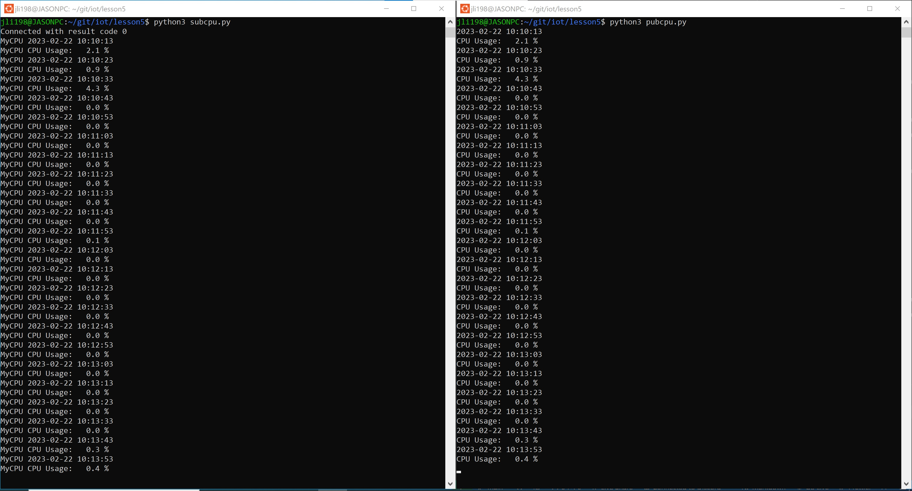

# Lab 5 - Paho-MQTT

* Study GitHub [repository](https://github.com/kevinwlu/iot/tree/master/lesson5) Lesson 5 labs
* Install Paho-MQTT
* Change directory to iot repository
* Update repository with git pull
* Change directory to Lesson 5
* Run python3 subcpu.py on one Terminal
* Run python3 pubcpu.py on another

## Install Paho and run code to subscribe on one terminal and publish on another (Raspberry Pi)

```sh
$ sudo pip3 install -U paho-mqtt
Looking in indexes: https://pypi.org/simple, https://www.piwheels.org/simple
Requirement already satisfied: paho-mqtt in /usr/local/lib/python3.9/dist-packages (1.6.1)
Collecting paho-mqtt
  Using cached https://www.piwheels.org/simple/paho-mqtt/paho_mqtt-1.6.1-py3-none-any.whl (75 kB)
  Downloading https://www.piwheels.org/simple/paho-mqtt/paho_mqtt-1.6.0-py3-none-any.whl (75 kB)
     |████████████████████████████████| 75 kB 282 kB/s 
$ git clone https://github.com/eclipse/paho.mqtt.python.git
$ cd ~/iot/lesson5
```

### Terminal 1 (press control-c to stop) (Raspberry Pi)

```sh
$ python3 subcpu.py
Connected with result code 0
```

### Terminal 2 (Raspberry Pi)

```sh
$ python3 pubcpu.py
2023-02-21 23:33:43
CPU Usage:   6.4 %
```


## Install Paho and run code to subscribe on one terminal and publish on another (Ubuntu)

```sh
$ git pull
remote: Enumerating objects: 496, done.
remote: Counting objects: 100% (408/408), done.
remote: Compressing objects: 100% (128/128), done.
remote: Total 496 (delta 221), reused 398 (delta 214), pack-reused 88
Receiving objects: 100% (496/496), 161.90 KiB | 1.32 MiB/s, done.
Resolving deltas: 100% (254/254), completed with 13 local objects.
From https://github.com/kevinwlu/iot
   37b88621..79aa5e9c  master     -> origin/master
Updating 37b88621..79aa5e9c
Fast-forward
 README.md                  | 96 ++++++----------------------------------------------------------
 apps/README.md             |  1 +
 cases/README.md            | 56 ++++++++++++++++++++++++++++++++-----
 economics/README.md        |  7 +++++
 lesson1/README.md          |  7 +++--
 lesson2/README.md          |  1 +
 lesson3/README.md          |  1 +
 lesson3/date_example.py    |  4 +--
 lesson4/README.md          |  3 ++
 lesson6/README.md          |  7 +++++
 lesson6/ds18b20/README.md  |  1 +
 lesson6/xiao/README.md     |  2 +-
 lesson6/xiao/imu/README.md | 12 ++++++++
 lesson8/README.md          | 15 ++++++++--
 lesson9/README.md          |  5 ++--
 special_problems/README.md | 20 ++++----------
 standards/README.md        |  4 ++-
 tools/README.md            | 36 ++++++++++++++++++++++--
 18 files changed, 158 insertions(+), 120 deletions(-)
 create mode 100644 lesson6/xiao/imu/README.md

$ sudo pip3 install -U paho-mqtt
Collecting paho-mqtt
  Downloading paho-mqtt-1.6.1.tar.gz (99 kB)
     ━━━━━━━━━━━━━━━━━━━━━━━━━━━━━━━━━━━━━━━━ 99.4/99.4 KB 3.1 MB/s eta 0:00:00
  Preparing metadata (setup.py) ... done
Building wheels for collected packages: paho-mqtt
  Building wheel for paho-mqtt (setup.py) ... done
  Created wheel for paho-mqtt: filename=paho_mqtt-1.6.1-py3-none-any.whl size=62118 sha256=9de7138a4190e6c2d3b92a179eba937c18e1afcf2578838872e886918528dded
  Stored in directory: /root/.cache/pip/wheels/8b/bb/0c/79444d1dee20324d442856979b5b519b48828b0bd3d05df84a
Successfully built paho-mqtt
Installing collected packages: paho-mqtt
Successfully installed paho-mqtt-1.6.1
WARNING: Running pip as the 'root' user can result in broken permissions and conflicting behaviour with the system package manager. It is recommended to use a virtual environment instead: https://pip.pypa.io/warnings/venv
```


