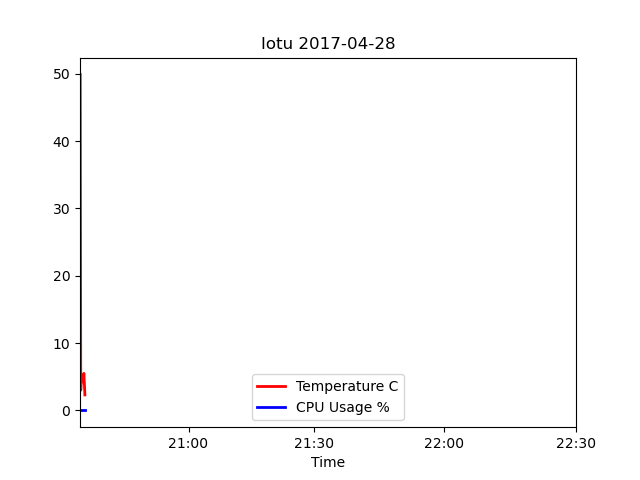
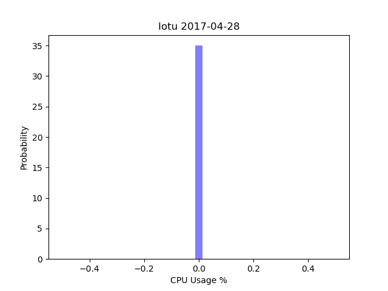
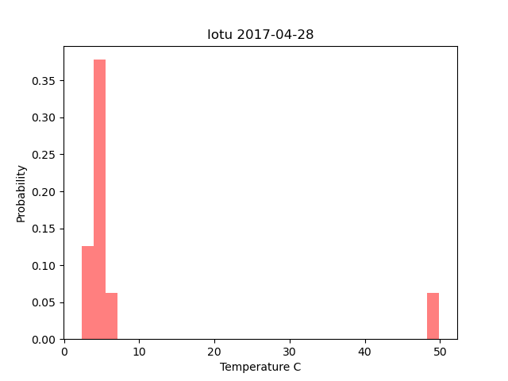
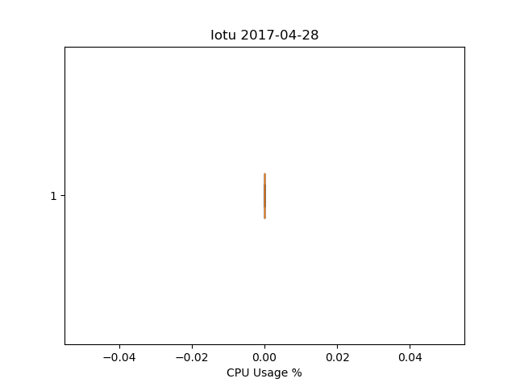
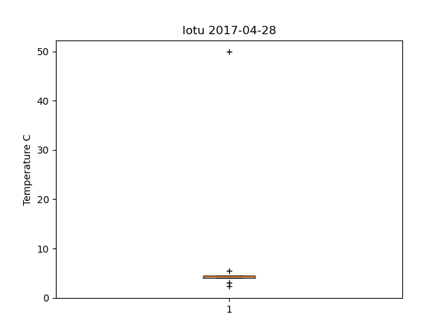
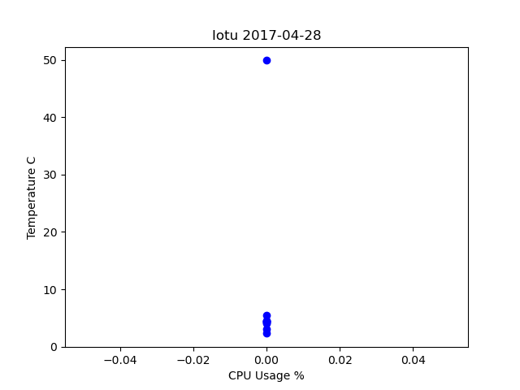
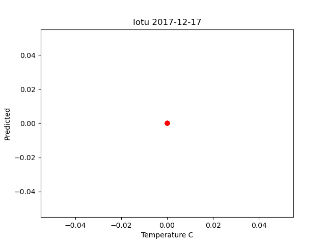

# Lab 8 - Data Analysis

* Study GitHub [repository](https://github.com/kevinwlu/iot/tree/master/lesson8) Lesson 8
* Install Python packages
* Save Lab 7 Google sheet in CSV format to ~/demo
* Copy ~/iot/lesson8/plt_final.py and plt_cv2.py to ~/demo
* Edit plt_final.py and plt_cv2.py to read CSV file with customized plot titles
* Run plt_final.py and plt_cv2.py

## Install Python Packages (Raspberry Pi)

```sh
$ sudo pip3 install numpy scipy scikit-learn matplotlib pandas tensorflow keras
Looking in indexes: https://pypi.org/simple, https://www.piwheels.org/simple
Requirement already satisfied: numpy in /usr/local/lib/python3.9/dist-packages (1.24.1)
Requirement already satisfied: scipy in /usr/lib/python3/dist-packages (1.6.0)
Requirement already satisfied: scikit-learn in /usr/local/lib/python3.9/dist-packages (1.2.0)
Requirement already satisfied: matplotlib in /usr/lib/python3/dist-packages (3.3.4)
Requirement already satisfied: pandas in /usr/lib/python3/dist-packages (1.1.5)
Collecting tensorflow
  Using cached tensorflow-2.11.0-cp39-cp39-manylinux_2_17_aarch64.manylinux2014_aarch64.whl (1.9 kB)
Requirement already satisfied: keras in /usr/local/lib/python3.9/dist-packages (2.3.1)
Requirement already satisfied: pyyaml in /usr/local/lib/python3.9/dist-packages (from keras) (3.12)
Requirement already satisfied: h5py in /usr/local/lib/python3.9/dist-packages (from keras) (3.7.0)
Requirement already satisfied: keras-applications>=1.0.6 in /usr/local/lib/python3.9/dist-packages (from keras) (1.0.8)
Requirement already satisfied: keras-preprocessing>=1.0.5 in /usr/local/lib/python3.9/dist-packages (from keras) (1.1.2)
Requirement already satisfied: six>=1.9.0 in /usr/local/lib/python3.9/dist-packages (from keras) (1.11.0)
Requirement already satisfied: joblib>=1.1.1 in /usr/local/lib/python3.9/dist-packages (from scikit-learn) (1.2.0)
Requirement already satisfied: threadpoolctl>=2.0.0 in /usr/local/lib/python3.9/dist-packages (from scikit-learn) (3.1.0)
Collecting tensorflow-cpu-aws==2.11.0
  Downloading tensorflow_cpu_aws-2.11.0-cp39-cp39-manylinux_2_17_aarch64.manylinux2014_aarch64.whl (216.2 MB)
     |████████████████████████████████| 216.2 MB 8.3 MB/s eta 0:00:01Killed
```

## Install Python Packages (Ubuntu)

```sh
$ sudo pip3 install numpy scipy scikit-learn matplotlib pandas tensorflow keras
Requirement already satisfied: numpy in /usr/local/lib/python3.10/dist-packages (1.24.1)
Requirement already satisfied: scipy in /usr/local/lib/python3.10/dist-packages (1.10.0)
Requirement already satisfied: scikit-learn in /usr/local/lib/python3.10/dist-packages (1.2.0)
Requirement already satisfied: matplotlib in /usr/local/lib/python3.10/dist-packages (3.6.3)
Requirement already satisfied: pandas in /usr/local/lib/python3.10/dist-packages (1.5.2)
Requirement already satisfied: tensorflow in /usr/local/lib/python3.10/dist-packages (2.11.0)
Requirement already satisfied: keras in /usr/local/lib/python3.10/dist-packages (2.11.0)
Requirement already satisfied: joblib>=1.1.1 in /usr/local/lib/python3.10/dist-packages (from scikit-learn) (1.2.0)
Requirement already satisfied: threadpoolctl>=2.0.0 in /usr/local/lib/python3.10/dist-packages (from scikit-learn) (3.1.0)
Requirement already satisfied: kiwisolver>=1.0.1 in /usr/local/lib/python3.10/dist-packages (from matplotlib) (1.4.4)
Requirement already satisfied: packaging>=20.0 in /usr/local/lib/python3.10/dist-packages (from matplotlib) (23.0)
Requirement already satisfied: pyparsing>=2.2.1 in /usr/lib/python3/dist-packages (from matplotlib) (2.4.7)
Requirement already satisfied: cycler>=0.10 in /usr/local/lib/python3.10/dist-packages (from matplotlib) (0.11.0)
Requirement already satisfied: python-dateutil>=2.7 in /usr/local/lib/python3.10/dist-packages (from matplotlib) (2.8.2)
Requirement already satisfied: fonttools>=4.22.0 in /usr/local/lib/python3.10/dist-packages (from matplotlib) (4.38.0)
Requirement already satisfied: pillow>=6.2.0 in /usr/local/lib/python3.10/dist-packages (from matplotlib) (9.4.0)
Requirement already satisfied: contourpy>=1.0.1 in /usr/local/lib/python3.10/dist-packages (from matplotlib) (1.0.7)
Requirement already satisfied: pytz>=2020.1 in /usr/local/lib/python3.10/dist-packages (from pandas) (2022.7)
Requirement already satisfied: absl-py>=1.0.0 in /usr/local/lib/python3.10/dist-packages (from tensorflow) (1.4.0)
Requirement already satisfied: tensorflow-io-gcs-filesystem>=0.23.1 in /usr/local/lib/python3.10/dist-packages (from tensorflow) (0.29.0)
Requirement already satisfied: flatbuffers>=2.0 in /usr/local/lib/python3.10/dist-packages (from tensorflow) (23.1.4)
Requirement already satisfied: gast<=0.4.0,>=0.2.1 in /usr/local/lib/python3.10/dist-packages (from tensorflow) (0.4.0)
Requirement already satisfied: protobuf<3.20,>=3.9.2 in /usr/local/lib/python3.10/dist-packages (from tensorflow) (3.19.6)
Requirement already satisfied: typing-extensions>=3.6.6 in /usr/local/lib/python3.10/dist-packages (from tensorflow) (4.4.0)
Requirement already satisfied: libclang>=13.0.0 in /usr/local/lib/python3.10/dist-packages (from tensorflow) (15.0.6.1)
Requirement already satisfied: setuptools in /usr/local/lib/python3.10/dist-packages (from tensorflow) (67.3.2)
Requirement already satisfied: h5py>=2.9.0 in /usr/local/lib/python3.10/dist-packages (from tensorflow) (3.7.0)
Requirement already satisfied: google-pasta>=0.1.1 in /usr/local/lib/python3.10/dist-packages (from tensorflow) (0.2.0)
Requirement already satisfied: six>=1.12.0 in /usr/lib/python3/dist-packages (from tensorflow) (1.16.0)
Requirement already satisfied: astunparse>=1.6.0 in /usr/local/lib/python3.10/dist-packages (from tensorflow) (1.6.3)
Requirement already satisfied: opt-einsum>=2.3.2 in /usr/local/lib/python3.10/dist-packages (from tensorflow) (3.3.0)
Requirement already satisfied: grpcio<2.0,>=1.24.3 in /usr/local/lib/python3.10/dist-packages (from tensorflow) (1.51.1)
Requirement already satisfied: tensorboard<2.12,>=2.11 in /usr/local/lib/python3.10/dist-packages (from tensorflow) (2.11.1)
Requirement already satisfied: termcolor>=1.1.0 in /usr/local/lib/python3.10/dist-packages (from tensorflow) (2.2.0)
Requirement already satisfied: wrapt>=1.11.0 in /usr/local/lib/python3.10/dist-packages (from tensorflow) (1.14.1)
Requirement already satisfied: tensorflow-estimator<2.12,>=2.11.0 in /usr/local/lib/python3.10/dist-packages (from tensorflow) (2.11.0)
Requirement already satisfied: wheel<1.0,>=0.23.0 in /usr/lib/python3/dist-packages (from astunparse>=1.6.0->tensorflow) (0.37.1)
Requirement already satisfied: tensorboard-plugin-wit>=1.6.0 in /usr/local/lib/python3.10/dist-packages (from tensorboard<2.12,>=2.11->tensorflow) (1.8.1)
Requirement already satisfied: google-auth-oauthlib<0.5,>=0.4.1 in /usr/local/lib/python3.10/dist-packages (from tensorboard<2.12,>=2.11->tensorflow) (0.4.6)
Requirement already satisfied: werkzeug>=1.0.1 in /usr/local/lib/python3.10/dist-packages (from tensorboard<2.12,>=2.11->tensorflow) (2.2.2)
Requirement already satisfied: google-auth<3,>=1.6.3 in /usr/local/lib/python3.10/dist-packages (from tensorboard<2.12,>=2.11->tensorflow) (2.16.0)
Requirement already satisfied: markdown>=2.6.8 in /usr/local/lib/python3.10/dist-packages (from tensorboard<2.12,>=2.11->tensorflow) (3.4.1)
Requirement already satisfied: requests<3,>=2.21.0 in /usr/local/lib/python3.10/dist-packages (from tensorboard<2.12,>=2.11->tensorflow) (2.28.2)
Requirement already satisfied: tensorboard-data-server<0.7.0,>=0.6.0 in /usr/local/lib/python3.10/dist-packages (from tensorboard<2.12,>=2.11->tensorflow) (0.6.1)
Requirement already satisfied: cachetools<6.0,>=2.0.0 in /usr/local/lib/python3.10/dist-packages (from google-auth<3,>=1.6.3->tensorboard<2.12,>=2.11->tensorflow) (5.2.1)
Requirement already satisfied: rsa<5,>=3.1.4 in /usr/local/lib/python3.10/dist-packages (from google-auth<3,>=1.6.3->tensorboard<2.12,>=2.11->tensorflow) (4.9)
Requirement already satisfied: pyasn1-modules>=0.2.1 in /usr/local/lib/python3.10/dist-packages (from google-auth<3,>=1.6.3->tensorboard<2.12,>=2.11->tensorflow) (0.2.8)
Requirement already satisfied: requests-oauthlib>=0.7.0 in /usr/local/lib/python3.10/dist-packages (from google-auth-oauthlib<0.5,>=0.4.1->tensorboard<2.12,>=2.11->tensorflow) (1.3.1)
Requirement already satisfied: certifi>=2017.4.17 in /usr/local/lib/python3.10/dist-packages (from requests<3,>=2.21.0->tensorboard<2.12,>=2.11->tensorflow) (2022.12.7)
Requirement already satisfied: urllib3<1.27,>=1.21.1 in /usr/local/lib/python3.10/dist-packages (from requests<3,>=2.21.0->tensorboard<2.12,>=2.11->tensorflow) (1.26.14)
Requirement already satisfied: charset-normalizer<4,>=2 in /usr/local/lib/python3.10/dist-packages (from requests<3,>=2.21.0->tensorboard<2.12,>=2.11->tensorflow) (3.0.1)
Requirement already satisfied: idna<4,>=2.5 in /usr/local/lib/python3.10/dist-packages (from requests<3,>=2.21.0->tensorboard<2.12,>=2.11->tensorflow) (3.4)
Requirement already satisfied: MarkupSafe>=2.1.1 in /usr/local/lib/python3.10/dist-packages (from werkzeug>=1.0.1->tensorboard<2.12,>=2.11->tensorflow) (2.1.1)
Requirement already satisfied: pyasn1<0.5.0,>=0.4.6 in /usr/local/lib/python3.10/dist-packages (from pyasn1-modules>=0.2.1->google-auth<3,>=1.6.3->tensorboard<2.12,>=2.11->tensorflow) (0.4.8)
Requirement already satisfied: oauthlib>=3.0.0 in /usr/lib/python3/dist-packages (from requests-oauthlib>=0.7.0->google-auth-oauthlib<0.5,>=0.4.1->tensorboard<2.12,>=2.11->tensorflow) (3.2.0)
WARNING: Running pip as the 'root' user can result in broken permissions and conflicting behaviour with the system package manager. It is recommended to use a virtual environment instead: https://pip.pypa.io/warnings/venv
```

## Save Lab 7 Google sheet in CSV format to ~/demo

[rpidata.csv](demo/rpidata.csv)

## Copy ~/iot/lesson8/plt_final.py and plt_cv2.py to ~/demo

[plt_final.py](demo/plt_final.py) </br>
[plt_cv2.py](demo/plt_cv2.py)

## Edit plt_final.py and plt_cv2.py to read CSV file with customized plot titles

plt_final.py
> data = read_csv('rpidata.csv')

plt_cv2.py
> X = read_csv('rpidata.csv', usecols=[1])
> Y = read_csv('rpidata.csv', usecols=[2])

## Run plt_final.py and plt_cv2.py (Raspberry Pi)








